# Badi eSIM Support Ticketing Module

### Interview Assignment · Implementation Plan


> [!NOTE]
> **Goal:** Build a small, production-minded support ticketing module using **FastAPI + PostgreSQL + React + TypeScript** within the suggested **4–5 hour timebox**.
>
> **Engineering principles:** **SDLC + Agile + SOLID + DRY + KISS + separation of concerns + testability + security-by-design**.

> [!TIP]
> **How to read this document**
>
> - Diagrams are written in [Mermaid](https://mermaid.js.org/). GitHub renders them natively. In VS Code, install the **Markdown Preview Mermaid Support** extension (`bierner.markdown-mermaid`) and open the preview with `Ctrl+Shift+V`.
> - 🆕 marks content that was added in this revision and is not in the original plan.
> - 📝 marks a proposed decision or assumption that should be confirmed and documented in the README.
> - Sections 1–49 keep the numbering of the original plan. Sections 50–57 hold the SQA review. The appendices hold the extras.

---

## Contents

| Part | Sections |
|------|----------|
| **A · Product and scope** | [1 Product Goal](#1-product-goal) · [2 Scope Decision](#2-scope-decision) · [3 Engineering Strategy](#3-engineering-strategy) |
| **B · Actors and domain** | [4 Actors](#4-actors) · [5 Domain Model](#5-domain-model) · [6 Users Table](#6-users-table) · [7 Tickets Table](#7-tickets-table) · [8 Ticket Number Logic](#8-ticket-number-logic) · [9 Ticket Creation Logic](#9-ticket-creation-logic) · [10 Ticket Messages](#10-ticket-messages) · [11 Audit Events](#11-audit-events) · [12 Transaction Rule](#12-transaction-rule) · [13 Status Transition Rules](#13-status-transition-rules) · [14 Resolution Rules](#14-resolution-rules) |
| **C · API and backend design** | [15 API Design](#15-api-design) · [16 API Responsibility](#16-api-responsibility) · [17 Service Layer](#17-service-layer) · [18 SOLID Rules](#18-solid-rules) · [19 DRY Rules](#19-dry-rules) · [20 Error Handling](#20-error-handling) |
| **D · Frontend and UX** | [21 Frontend Architecture](#21-frontend-architecture) · [22 Customer UI](#22-customer-ui) · [23 Customer Ticket Detail](#23-customer-ticket-detail) · [24 Agent UI](#24-agent-ui) · [25 Agent Ticket Detail](#25-agent-ticket-detail) · [26 Buttons Must Have Clear Logic](#26-buttons-must-have-clear-logic) · [27 Realtime Messaging](#27-realtime-messaging) · [28 Loading States](#28-loading-states) · [29 Empty States](#29-empty-states) · [30 Error States](#30-error-states) · [31 Accessibility and UX](#31-accessibility-and-ux) |
| **E · Data, quality and security** | [32 Database Indexes](#32-database-indexes) · [33 SQLAlchemy Rules](#33-sqlalchemy-rules) · [34 Migration Strategy](#34-migration-strategy) · [35 Seed Data](#35-seed-data) · [36 Testing Strategy](#36-testing-strategy) · [37 Test Pyramid](#37-test-pyramid) · [38 Security Rules](#38-security-rules) · [39 Authentication Assumption](#39-authentication-assumption) · [40 Mock Order](#40-mock-order) |
| **F · Delivery** | [41 Repository Structure](#41-repository-structure) · [42 Git Strategy](#42-git-strategy) · [43 Definition of Done](#43-definition-of-done) · [44 Acceptance Criteria](#44-acceptance-criteria) · [45 Timeboxed Implementation Plan](#45-timeboxed-implementation-plan) · [46 What NOT to Build](#46-what-not-to-build) · [47 Future Improvements](#47-future-improvements) · [48 Final Architecture](#48-final-architecture) · [49 Final Engineering Principle](#49-final-engineering-principle) |
| **G · SQA review** | [50 SQA Review Overview](#50-sqa-review-overview) · [51 Full Requirement Coverage](#51-full-requirement-coverage) · [52 Additional Quality Gates](#52-additional-quality-gates) · [53 Database Constraints](#53-database-constraints) · [54 API QA Matrix](#54-api-qa-matrix) · [55 Frontend QA Matrix](#55-frontend-qa-matrix) · [56 Final Acceptance Test](#56-final-acceptance-test) · [57 Bonus Features Are Deferred](#57-bonus-features-are-deferred) |
| **H · Appendices** 🆕 | [A Assumptions and Trade-offs](#appendix-a-assumptions-and-trade-offs) · [B Risk Register](#appendix-b-risk-register) · [C Demo Walkthrough](#appendix-c-demo-walkthrough) · [D Submission Checklist](#appendix-d-submission-checklist) · [E Glossary](#appendix-e-glossary) |

---

## At a Glance

> 🆕 *Added in this revision: a one-page summary of the whole plan.*

| | |
|---|---|
| 🎯 **Product** | Support ticketing for Badi eSIM customers and support agents |
| 🧱 **Stack** | React + TypeScript · FastAPI · SQLAlchemy · Alembic · PostgreSQL · WebSocket · Pytest |
| 👥 **Roles** | `CUSTOMER` · `AGENT` |
| 🗄️ **Core tables** | `users` · `tickets` · `ticket_messages` · `ticket_events` |
| 🚦 **Statuses (6)** | `OPEN` · `IN_PROGRESS` · `WAITING_FOR_CUSTOMER` · `WAITING_FOR_PROVIDER` · `RESOLVED` · `CLOSED` |
| 🔥 **Priorities (4)** | `LOW` · `MEDIUM` · `HIGH` · `URGENT` |
| 🏷️ **Categories (7)** | `INSTALLATION` · `ACTIVATION` · `CONNECTIVITY` · `ORDER` · `TOPUP` · `REFUND` · `OTHER` |
| 💬 **Message types (2)** | `REPLY` (customer-visible) · `INTERNAL_NOTE` (agents only) |
| 🧾 **Audit events** | `STATUS_CHANGED` and `ASSIGNED` (minimum) · `PRIORITY_CHANGED` (recommended) |
| 🔌 **Endpoints (7)** | `POST /tickets` · `GET /tickets` · `GET /tickets/{id}` · `PATCH /tickets/{id}` · `POST /tickets/{id}/messages` · `WS /tickets/{id}/ws` · `GET /mock/orders/{order_id}` |
| 🔖 **Ticket number** | `BD-1001`, `BD-1002`, `BD-1003` … generated by the database |
| 🧪 **Tests** | Minimum 2 automated tests · target 4+ |
| ⏱️ **Timebox** | 4–5 hours in 9 phases (see [section 45](#45-timeboxed-implementation-plan)) |
| 🚫 **Not building** | Microservices, Kafka, RabbitMQ, Kubernetes, complex auth, real eSIM provider, AI features |

### Plan on a page

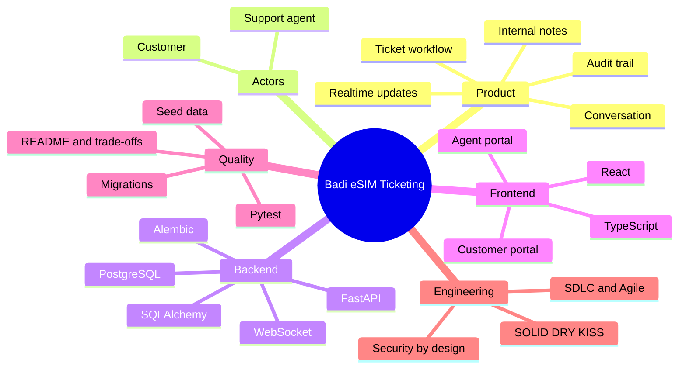

### The life of a ticket

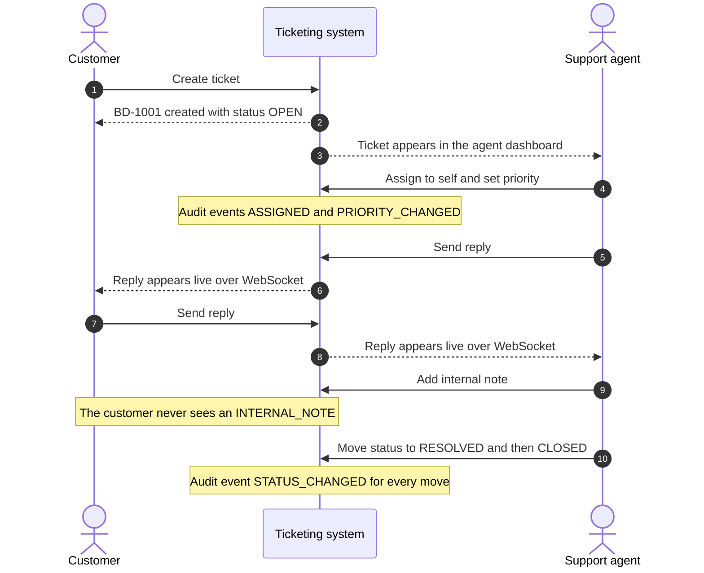

---

## Part A · Product and Scope

### 1. Product Goal

Badi eSIM customers need a simple way to create and follow support cases. Support agents need to manage those cases, communicate with customers, assign ownership, change status/priority, and keep an audit trail.

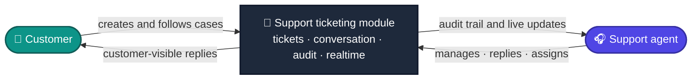

**The system must support:**

| Group | Capabilities |
|-------|--------------|
| 🎫 **Tickets** | Ticket creation · Ticket number generation · Ticket status workflow · Priority and category · Useful ticket filtering |
| 👥 **Roles and ownership** | Customer and agent roles · Assignment/reassignment |
| 💬 **Communication** | Conversation history · Customer-visible replies · Agent-only internal notes · Realtime customer-visible messages |
| 🛡️ **Trust and integrity** | Audit history · Validation and error handling |
| 🚢 **Delivery** | Automated tests · Database migrations · Seed/demo data · Clear README and documented trade-offs |

---

### 2. Scope Decision

#### Frontend

Use **one React + TypeScript application** for both roles.

```text
React + TypeScript
├── Customer Portal
└── Agent Portal
```

> [!IMPORTANT]
> Do not create a second frontend for the core assignment.

React Native / Expo is optional in the assignment, but the 4–5 hour timebox makes a single React application the safer core implementation.

If the core system is complete and time remains, an Expo customer app can be considered a bonus.

#### Backend

| Layer | Technology |
|-------|------------|
| API framework | **FastAPI** |
| ORM | **SQLAlchemy** |
| Migrations | **Alembic** |
| Database | **PostgreSQL** |
| Realtime | **WebSocket** |
| Testing | **Pytest** |

#### Deployment

Docker is desirable, but application correctness comes first.

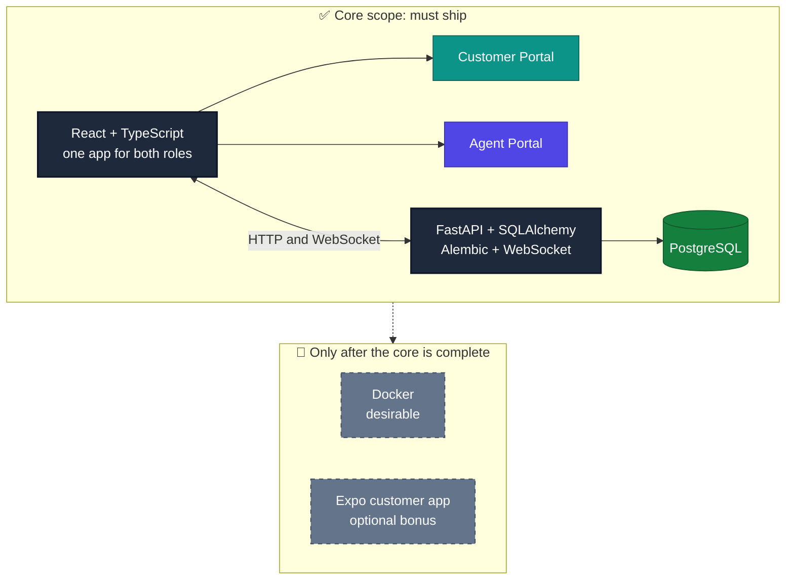

---

### 3. Engineering Strategy

The implementation will follow a lightweight **SDLC**:

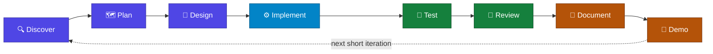

Use short Agile iterations rather than attempting the entire application in one pass.

#### Agile sprints

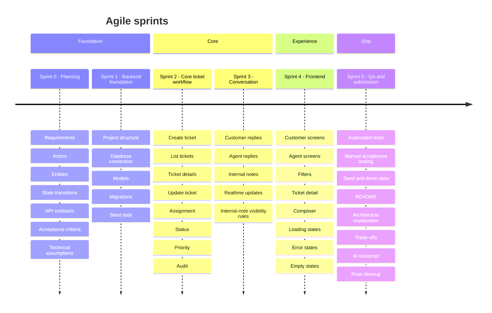

| Sprint | Theme | Mode | What it covers |
|--------|-------|------|----------------|
| **0** | Planning | *Define* | Requirements, actors, entities, state transitions, API contracts, acceptance criteria, technical assumptions |
| **1** | Backend Foundation | *Deliver* | Project structure, database connection, models, migrations, seed data |
| **2** | Core Ticket Workflow | *Deliver* | Create ticket, list tickets, ticket details, update ticket, assignment, status, priority, audit |
| **3** | Conversation | *Deliver* | Customer replies, agent replies, internal notes, realtime updates, internal-note visibility rules |
| **4** | Frontend | *Deliver* | Customer screens, agent screens, filters, ticket detail, composer, loading/error/empty states |
| **5** | QA + Submission | *Deliver* | Automated tests, manual acceptance testing, seed/demo data, README, architecture explanation, trade-offs, AI transcript, final cleanup |

---

## Part B · Actors and Domain

### 4. Actors

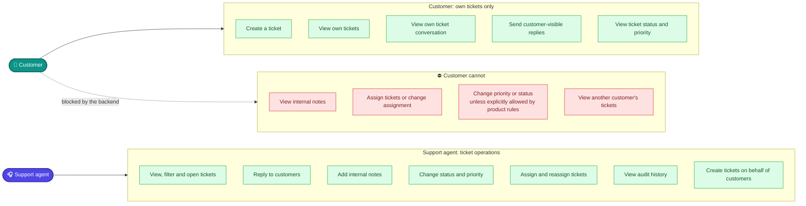

#### Permission matrix

| Capability | 👤 Customer | 🎧 Support agent |
|------------|:-----------:|:----------------:|
| Create a ticket | ✅ | ✅ |
| Create tickets on behalf of customers | ➖ | ✅ |
| View tickets | ✅ own tickets only | ✅ |
| View another customer's tickets | ⛔ | ✅ |
| Filter tickets | ✅ status filter on own list | ✅ status, priority, category, assignee, search |
| Open a ticket and view its conversation | ✅ own tickets only | ✅ |
| Send customer-visible replies | ✅ | ✅ (reply to customers) |
| Add internal notes | ⛔ | ✅ |
| View internal notes | ⛔ | ✅ |
| View ticket status | ✅ | ✅ |
| View ticket priority | ✅ | ✅ |
| Change status | ⛔ unless explicitly allowed by product rules | ✅ |
| Change priority | ⛔ unless explicitly allowed by product rules | ✅ |
| Assign / reassign tickets, change agent assignment | ⛔ | ✅ |
| View audit history | ➖ | ✅ |

> ✅ allowed · ⛔ explicitly not allowed · ➖ not specified in the assignment (treat as hidden or unavailable by default)

---

### 5. Domain Model

**Core tables**

- `users`
- `tickets`
- `ticket_messages`
- `ticket_events`

**Optional**

- `orders` (the assignment only needs a read-only mock, see [section 40](#40-mock-order))

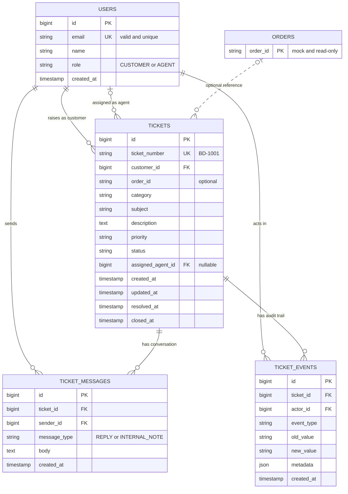

> 📝 Column types in the diagram are suggestions. The field lists are in sections 6, 7, 10 and 11.

**How the entities relate**

| From | Relationship | To |
|------|--------------|----|
| User (as **Customer**) | raises | Tickets |
| User (as **Agent**) | is assigned | Tickets |
| User (as **Sender**) | sends | Messages |
| User (as **Actor**) | performs | Audit events |
| Ticket | belongs to | Customer |
| Ticket | is handled by | Assigned agent |
| Ticket | contains | Messages |
| Ticket | records | Audit events |

---

### 6. Users Table

| Field | Notes |
|-------|-------|
| `id` | Primary key |
| `email` | Must be a valid email address · should be unique |
| `name` | Display name |
| `role` | Known enum: `CUSTOMER` or `AGENT` |
| `created_at` | Creation timestamp |

**Roles**

| Role | Meaning |
|------|---------|
| `CUSTOMER` | Creates and follows own tickets |
| `AGENT` | Manages tickets, replies, adds internal notes, assigns |

**Rules**

- Email must be valid.
- Email should be unique.
- Role must be a known enum.

> [!WARNING]
> Do not store passwords because authentication is outside the assignment scope.

---

### 7. Tickets Table

| Field | Notes |
|-------|-------|
| `id` | Internal primary key. Not the customer-facing identifier |
| `ticket_number` | Customer-facing identifier such as `BD-1001` ([section 8](#8-ticket-number-logic)) |
| `customer_id` | The customer who owns the ticket |
| `order_id` | Optional reference to an order ([section 40](#40-mock-order)) |
| `category` | One of the categories below |
| `subject` | Short title of the problem |
| `description` | Full description of the problem |
| `priority` | One of the priorities below |
| `status` | One of the statuses below. Always `OPEN` on creation |
| `assigned_agent_id` | The agent handling the ticket. Empty until someone is assigned |
| `created_at` | Creation timestamp |
| `updated_at` | Last change timestamp |
| `resolved_at` | Set when the status becomes `RESOLVED` ([section 14](#14-resolution-rules)) |
| `closed_at` | Set when the status becomes `CLOSED` ([section 14](#14-resolution-rules)) |

#### Status

| Value | Meaning |
|-------|---------|
| `OPEN` | New ticket, nobody has started working on it |
| `IN_PROGRESS` | An agent is actively working on it |
| `WAITING_FOR_CUSTOMER` | The agent needs information from the customer |
| `WAITING_FOR_PROVIDER` | The agent is waiting for the eSIM provider |
| `RESOLVED` | A solution was delivered (sets `resolved_at`) |
| `CLOSED` | The case is finished (sets `closed_at`) |

#### Priority

| Value | Meaning |
|-------|---------|
| 🟢 `LOW` | No urgency |
| 🟡 `MEDIUM` | Normal handling |
| 🟠 `HIGH` | Should be handled soon |
| 🔴 `URGENT` | Needs immediate attention |

#### Category

| Value | Typical topic |
|-------|---------------|
| `INSTALLATION` | Installing the eSIM profile |
| `ACTIVATION` | Activating the eSIM |
| `CONNECTIVITY` | No signal or no data |
| `ORDER` | Questions about an order |
| `TOPUP` | Adding data or balance |
| `REFUND` | Refund requests |
| `OTHER` | Anything else |

---

### 8. Ticket Number Logic

> [!IMPORTANT]
> The database ID should **not** be used as the customer-facing ticket identifier.

Expected format:

```text
BD-1001
BD-1002
BD-1003
```

Use a **PostgreSQL sequence** or an equivalent concurrency-safe mechanism.

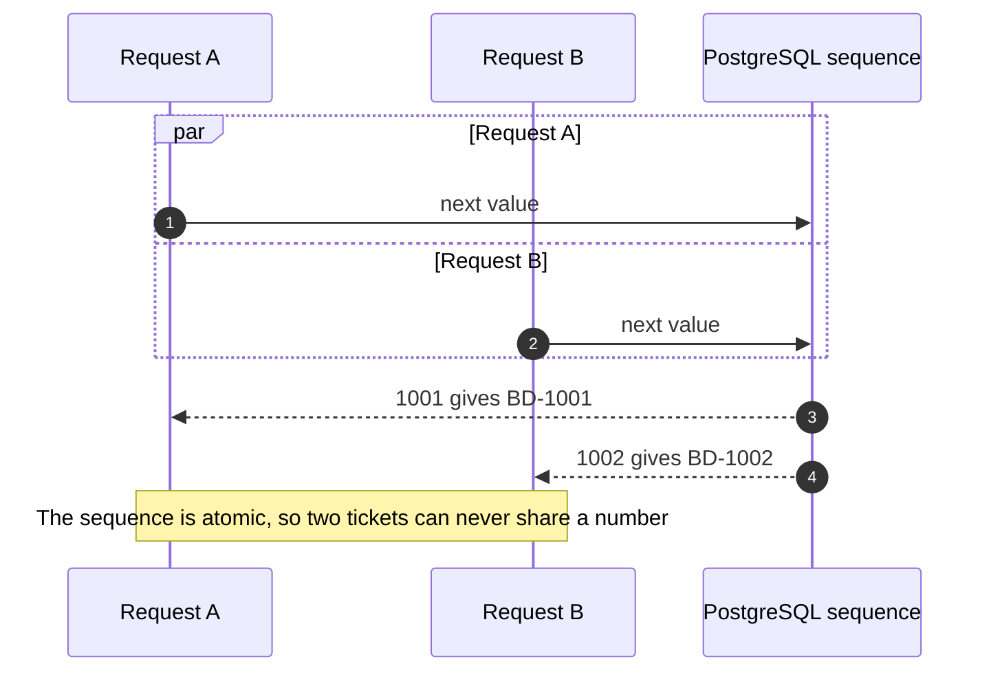

**Acceptance criteria**

- [ ] Every ticket gets a unique ticket number.
- [ ] Ticket number is readable.
- [ ] Ticket starts with `BD-`.
- [ ] Concurrent ticket creation must not generate duplicates.

| | Internal database ID | Ticket number |
|---|---|---|
| **Example** | `1` | `BD-1001` |
| **Shown to customers** | ⛔ No | ✅ Yes |
| **Generated by** | Database | Database sequence, server-side |

---

### 9. Ticket Creation Logic

A **customer or an agent** can create a ticket.

| Field | Required | Validation |
|-------|:--------:|------------|
| `customer_email` | ✅ | Valid email format |
| `category` | ✅ | Must be a known category |
| `subject` | ✅ | Not empty · maximum length enforced |
| `description` | ✅ | Not empty |
| `priority` | ✅ | `LOW`, `MEDIUM`, `HIGH` or `URGENT` |
| `order_id` | ➖ Optional | Empty is allowed |

**Business logic**

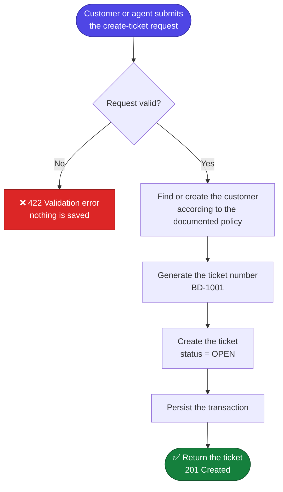

> [!IMPORTANT]
> Default status must **always** be `OPEN`. The frontend should not be trusted to enforce this business rule.

> [!NOTE]
> 📝 **Policy to document:** "Find or create the customer" needs a written rule. Proposed: look the user up by `customer_email`. If nobody matches, create a new `CUSTOMER` user. If the email belongs to an `AGENT`, reject the request.

---

### 10. Ticket Messages

| Field | Notes |
|-------|-------|
| `id` | Primary key |
| `ticket_id` | The ticket this message belongs to |
| `sender_id` | The user who wrote the message |
| `message_type` | `REPLY` or `INTERNAL_NOTE` |
| `body` | Message text |
| `created_at` | Creation timestamp |

**Message types**

| Type | Visible to |
|------|------------|
| 💬 `REPLY` | Customer and agent |
| 🔒 `INTERNAL_NOTE` | Agents only |

> [!IMPORTANT]
> Internal notes must be protected at the **backend/API layer**, not only hidden by the frontend.
> Never depend on CSS or frontend filtering for authorization.

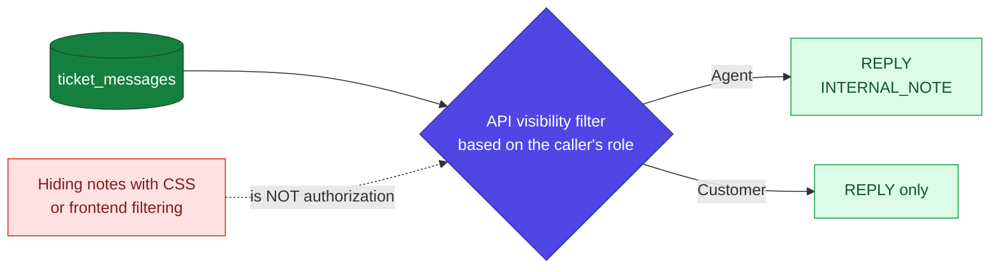

---

### 11. Audit Events

| Field | Notes |
|-------|-------|
| `id` | Primary key |
| `ticket_id` | The ticket that changed |
| `actor_id` | The user who made the change |
| `event_type` | What kind of change happened |
| `old_value` | Value before the change |
| `new_value` | Value after the change |
| `metadata` | Extra structured details |
| `created_at` | When the change happened |

**Events**

| Event | Level | Example |
|-------|:-----:|---------|
| `STATUS_CHANGED` | **Minimum** | `OPEN → IN_PROGRESS` |
| `ASSIGNED` | **Minimum** | `Anas → Rahim` |
| `PRIORITY_CHANGED` | *Recommended* | `MEDIUM → HIGH` |

Example:

```text
STATUS_CHANGED
OPEN → IN_PROGRESS
```

or:

```text
ASSIGNED
Anas → Rahim
```

> [!IMPORTANT]
> Audit records should be **append-only**. Do not edit historical audit records.

**Example audit trail for one ticket** 🆕 *(illustrative)*

| # | Event | Old value | New value |
|:-:|-------|-----------|-----------|
| 1 | `ASSIGNED` | *(none)* | Anas |
| 2 | `STATUS_CHANGED` | `OPEN` | `IN_PROGRESS` |
| 3 | `PRIORITY_CHANGED` | `MEDIUM` | `HIGH` |
| 4 | `ASSIGNED` | Anas | Rahim |

---

### 12. Transaction Rule

Changes that require audit records must be **atomic**.

Example:

```text
BEGIN TRANSACTION

Update ticket status
Insert STATUS_CHANGED event

COMMIT
```

If the audit insert fails:

```text
ROLLBACK
```

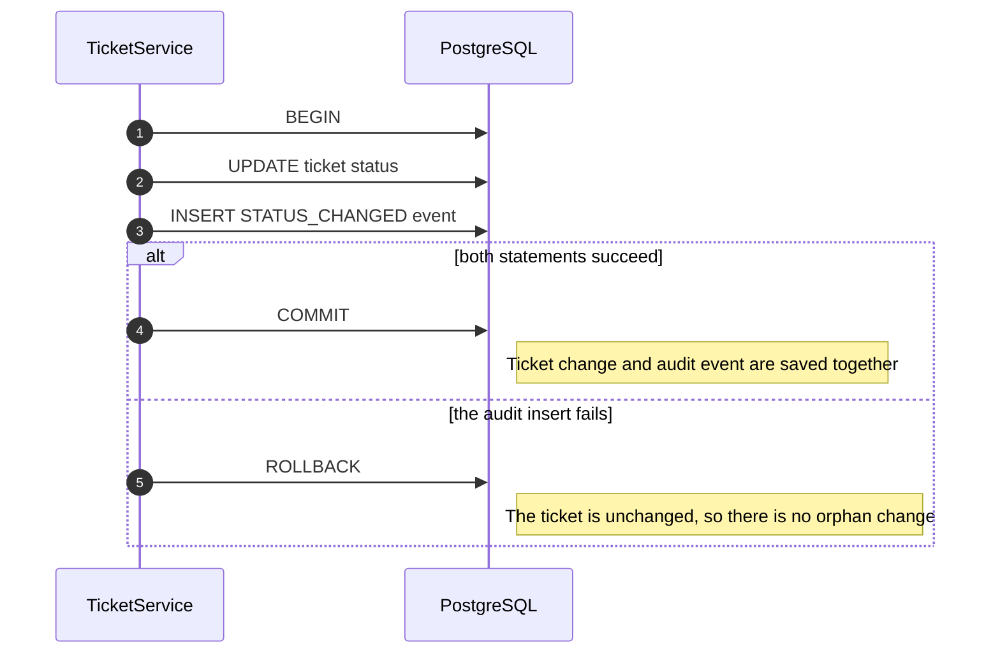

The system must **not** end up with:

```text
Ticket changed
but
Audit missing
```

---

### 13. Status Transition Rules

Define valid transitions **explicitly**.

Initial state: `OPEN`

Example valid flow:

```text
OPEN → IN_PROGRESS → WAITING_FOR_CUSTOMER → IN_PROGRESS → RESOLVED → CLOSED
```

Provider flow:

```text
IN_PROGRESS → WAITING_FOR_PROVIDER → IN_PROGRESS
```

> [!WARNING]
> Do not silently allow arbitrary state jumps unless product requirements require them.

- The **service layer** owns transition validation.
- The **UI** only presents available choices.

#### 📝 Recommended transition map

> 🆕 *Added in this revision. The original plan asks for an explicit map but does not spell it out. Confirm this proposal before coding and document it in the README.*

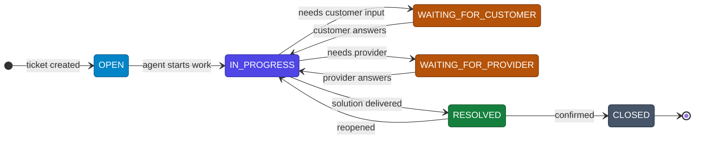

| From | Allowed next states |
|------|---------------------|
| `OPEN` | `IN_PROGRESS` |
| `IN_PROGRESS` | `WAITING_FOR_CUSTOMER` · `WAITING_FOR_PROVIDER` · `RESOLVED` |
| `WAITING_FOR_CUSTOMER` | `IN_PROGRESS` |
| `WAITING_FOR_PROVIDER` | `IN_PROGRESS` |
| `RESOLVED` | `CLOSED` · `IN_PROGRESS` (reopen) |
| `CLOSED` | none (final) |

Anything not in the table, for example `OPEN → CLOSED`, is rejected with `409 Conflict`.

#### Where the rule lives

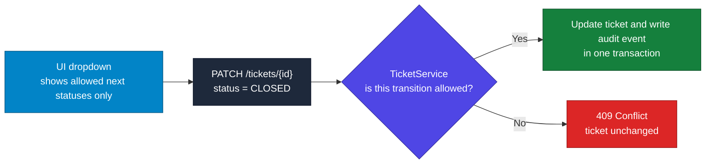

---

### 14. Resolution Rules

| When the status becomes | Set |
|-------------------------|-----|
| `RESOLVED` | `resolved_at = current timestamp` |
| `CLOSED` | `closed_at = current timestamp` |

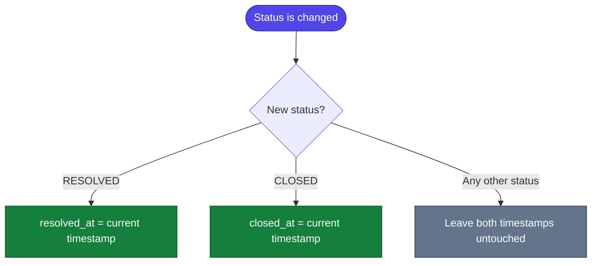

If a ticket is moved away from a terminal state, document whether timestamps are **cleared** or **preserved**.

> [!NOTE]
> For the assignment, **preserve** historical timestamps unless there is a strong product reason to change them.

---

## Part C · API and Backend Design

### 15. API Design

Base path:

```text
/api/v1
```

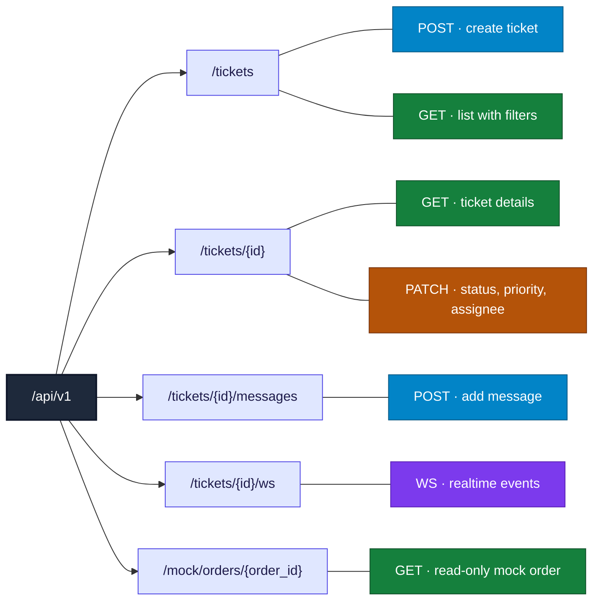

| Method | Endpoint | Purpose | Access 📝 |
|:------:|----------|---------|-----------|
| 🔵 `POST` | `/api/v1/tickets` | **Create Ticket** | Customer, Agent |
| 🟢 `GET` | `/api/v1/tickets` | **List Tickets** (with filters) | Customer (own tickets), Agent (all tickets) |
| 🟢 `GET` | `/api/v1/tickets/{id}` | **Ticket Details** | Customer (own ticket), Agent |
| 🟠 `PATCH` | `/api/v1/tickets/{id}` | **Update Ticket**: `status`, `priority`, `assigned_agent_id` | Agent |
| 🔵 `POST` | `/api/v1/tickets/{id}/messages` | **Add Message** | Customer (`REPLY`), Agent (`REPLY`, `INTERNAL_NOTE`) |
| 🟣 `WS` | `/api/v1/tickets/{id}/ws` | **Realtime** | Customer (own ticket), Agent |
| 🟢 `GET` | `/api/v1/mock/orders/{order_id}` | **Mock Order** | Read-only, no real provider |

#### List filters

Supported filters:

| Query parameter | Example |
|-----------------|---------|
| `status` | `OPEN` |
| `priority` | `HIGH` |
| `category` | `CONNECTIVITY` |
| `assigned_agent_id` | `3` |
| `search` | `esim` |
| `page` | `1` |
| `page_size` | `20` |

Example:

```http
GET /api/v1/tickets?status=OPEN&priority=HIGH
```

---

### 16. API Responsibility

Routes should be **thin**.

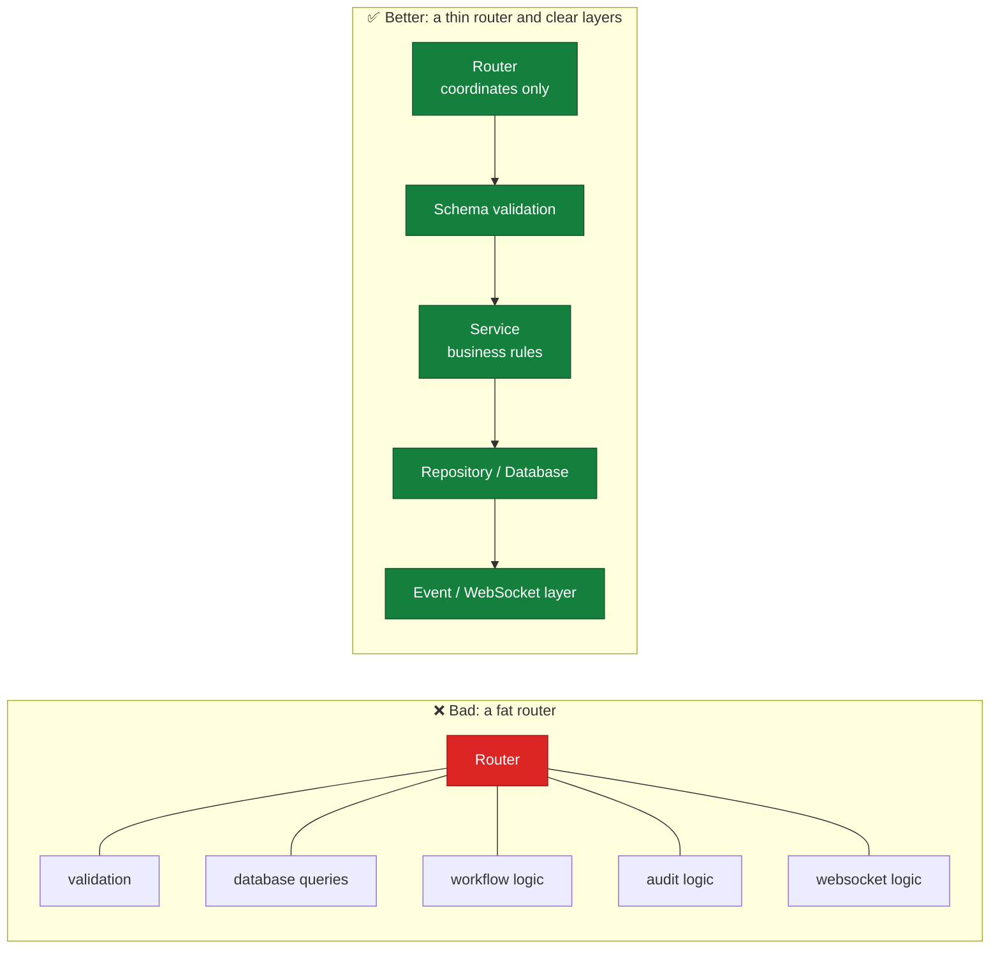

The router should **coordinate**, not contain the business domain.

| Layer | Responsibility | Must not |
|-------|----------------|----------|
| **Router** | Receive the request, call validation and the service, return the response | Contain queries, workflow, audit or websocket logic |
| **Schema validation** | Check the shape and values of input and output | Decide business rules |
| **Service** | Own the business rules: transitions, visibility, audit | Know about HTTP details or connection configuration |
| **Repository / Database** | Run queries and persist data | Make business decisions |
| **Event / WebSocket layer** | Broadcast events to connected clients | Own business rules |

---

### 17. Service Layer

Suggested services:

| Service | Owns |
|---------|------|
| 🎫 **TicketService** | Ticket creation · Status transitions · Assignment · Priority changes · Ticket business rules |
| 💬 **MessageService** | Reply creation · Internal note creation · Visibility rules · Message validation |
| 🧾 **AuditService** | Event creation · Event formatting · Audit history retrieval |

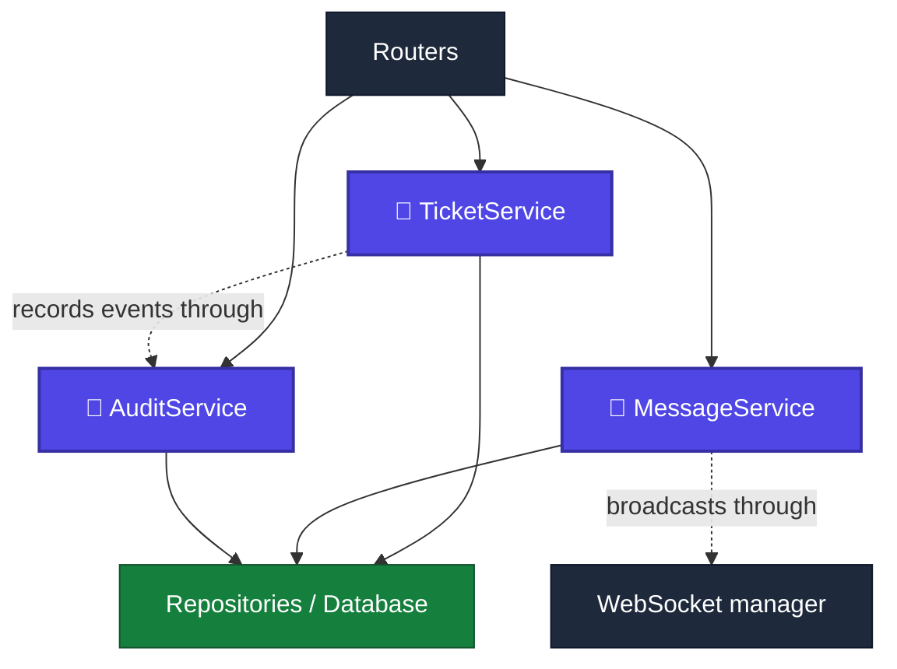

---

### 18. SOLID Rules

| | Principle | Rule of thumb |
|:-:|-----------|---------------|
| **S** | Single Responsibility | Each class/module should have one main reason to change. Example: `TicketService` should not also manage PostgreSQL connection configuration. |
| **O** | Open/Closed | Use enums, services and clear abstractions rather than repeatedly changing unrelated code. |
| **L** | Liskov | Avoid artificial inheritance. Prefer composition where inheritance adds no value. |
| **I** | Interface Segregation | Do not create huge interfaces that every service must implement. |
| **D** | Dependency Inversion | Services should depend on database/session abstractions where useful rather than tightly coupling all business logic to framework code. |

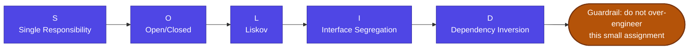

> [!WARNING]
> Do not over-engineer this small assignment just to demonstrate SOLID.

---

### 19. DRY Rules

**Avoid duplicate:**

| Avoid duplicating | One clear home 📝 |
|-------------------|-------------------|
| Validation logic | Pydantic schemas |
| Enum definitions | One shared enums module used by models and schemas |
| Response formatting | Response schemas and one error handler |
| Ticket status logic | The transition map inside `TicketService` |
| Audit creation logic | `AuditService` |
| Database connection setup | One database module in `core/` |

**However:** DRY does not mean forcing unrelated code into one giant helper.

> [!TIP]
> Prefer readable duplication over a complicated abstraction that is harder to understand.

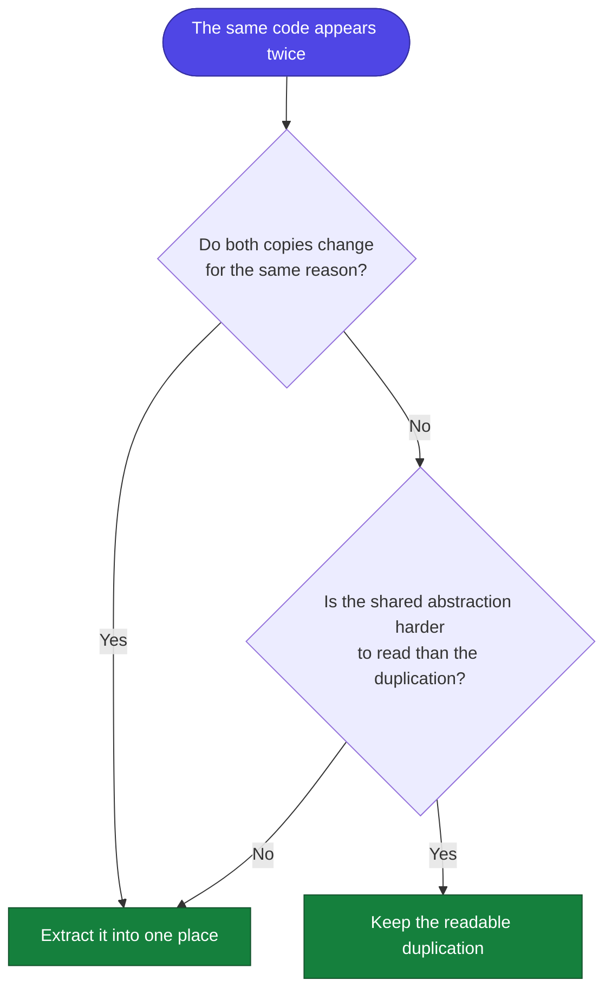

---

### 20. Error Handling

Expected errors:

| Code | Name | Typical cause |
|:----:|------|---------------|
| `400` | Bad Request | The request itself is malformed |
| `404` | Not Found | Ticket or agent does not exist |
| `409` | Conflict | Invalid status transition |
| `422` | Validation Error | Invalid or missing field, category or priority |
| `500` | Internal Server Error | Unexpected failure. Return a generic message |
| `403` 📝 | Forbidden | The caller's role or ownership does not allow the action |

Examples:

| Situation | Proposed response 📝 |
|-----------|----------------------|
| Ticket not found | `404` |
| Agent not found | `404` |
| Invalid status transition | `409` |
| Customer cannot access another customer's ticket | `403`, or `404` so the ticket's existence is not revealed |
| Internal notes are not customer-visible | Never returned to customers. A customer trying to post one gets `403` |
| Invalid category | `422` |
| Invalid priority | `422` |

> [!IMPORTANT]
> Use **consistent** error responses. Do **not** expose raw database exceptions to users.

Suggested error shape 📝:

```json
{
  "error": {
    "code": "INVALID_STATUS_TRANSITION",
    "message": "A ticket cannot move from OPEN to CLOSED.",
    "details": { "from": "OPEN", "to": "CLOSED" }
  }
}
```

```mermaid
flowchart LR
    subgraph SRC["What can go wrong"]
        e1["Invalid input"]
        e2["Missing record"]
        e3["Broken business rule"]
        e4["Not allowed"]
        e5["Database or code failure"]
    end
    H{{"Centralized exception handlers"}}:::gate
    subgraph OUT["What the client receives"]
        r1["400 or 422"]:::warn
        r2["404"]:::warn
        r3["409"]:::warn
        r4["403"]:::warn
        r5["500 with a safe generic message<br/>no stack trace, no raw SQL error"]:::bad
    end
    e1 --> H
    e2 --> H
    e3 --> H
    e4 --> H
    e5 --> H
    H --> r1
    H --> r2
    H --> r3
    H --> r4
    H --> r5

    classDef gate fill:#4f46e5,stroke:#3730a3,color:#ffffff
    classDef warn fill:#b45309,stroke:#78350f,color:#ffffff
    classDef bad fill:#dc2626,stroke:#991b1b,color:#ffffff
```

---

## Part D · Frontend and UX

> 🆕 *Screen map added in this revision.*

```mermaid
flowchart LR
    subgraph CUST["👤 Customer portal"]
        direction LR
        CL["Ticket List<br/>Create Ticket · Status filter"] -->|"Create Ticket"| CF["Create Ticket form"]
        CF -->|"Ticket created: BD-1001"| CD["Ticket Detail<br/>conversation and reply"]
        CL -->|"open a ticket"| CD
    end
    subgraph AGT["🎧 Agent portal"]
        direction LR
        AL["Ticket List<br/>Status · Priority · Category<br/>Assigned Agent · Search"] -->|"open a ticket"| AD["Ticket Detail<br/>Status · Priority · Assignee<br/>Reply or Internal Note"]
    end

    classDef cust fill:#0d9488,stroke:#115e59,color:#ffffff
    classDef agent fill:#4f46e5,stroke:#3730a3,color:#ffffff
    class CL,CF,CD cust
    class AL,AD agent
```

### 21. Frontend Architecture

```text
frontend/
├── src/
│   ├── api/
│   ├── components/
│   ├── pages/
│   ├── hooks/
│   ├── types/
│   ├── utils/
│   └── App.tsx
```

Keep API calls outside UI components where practical.

Example:

- `api/tickets.ts` handles HTTP communication.
- Components handle presentation and user interaction.
- Business rules should primarily remain on the backend.

```mermaid
flowchart LR
    P["pages/<br/>screens and routing"]:::ui --> C["components/<br/>presentation and interaction"]:::ui
    P --> H["hooks/<br/>state and data loading"]:::logic
    H --> A["api/tickets.ts<br/>HTTP communication"]:::api
    A --> B["FastAPI backend<br/>owns the business rules"]:::back
    T["types/<br/>shared TypeScript types"]:::shared -.-> P
    T -.-> H
    T -.-> A
    U["utils/<br/>formatting helpers"]:::shared -.-> C

    classDef ui fill:#0284c7,stroke:#075985,color:#ffffff
    classDef logic fill:#4f46e5,stroke:#3730a3,color:#ffffff
    classDef api fill:#b45309,stroke:#78350f,color:#ffffff
    classDef back fill:#15803d,stroke:#14532d,color:#ffffff
    classDef shared fill:#64748b,stroke:#334155,color:#ffffff
```

---

### 22. Customer UI

#### Ticket List

**Inputs/buttons**

- `[Create Ticket]`
- `[Status filter]`

**Display**

`Ticket Number` · `Subject` · `Category` · `Priority` · `Status` · `Updated time`

```text
┌───────────────────────────────────────────────────────────────────────────────────┐
│ My Tickets                                                    [ + Create Ticket ] │
│ Status filter: [ All ▾ ]                                                          │
├───────────────────────────────────────────────────────────────────────────────────┤
│ Number   Subject                     Category      Priority  Status       Updated │
│ -------  --------------------------  ------------  --------  -----------  ------- │
│ BD-1001  eSIM has no data in Turkey  CONNECTIVITY  HIGH      IN_PROGRESS  2h ago  │
│ BD-1002  Cannot activate my eSIM     ACTIVATION    MEDIUM    OPEN         1d ago  │
│ BD-1004  Top-up did not arrive       TOPUP         LOW       RESOLVED     3d ago  │
└───────────────────────────────────────────────────────────────────────────────────┘
```

#### Create Ticket

| Field | Validation |
|-------|------------|
| Customer email | Email format |
| Order ID | Optional |
| Category | Category required |
| Subject | Subject required |
| Description | Description required |
| Priority | Priority required |
| **[Create Ticket]** | Submits the form |

```text
┌────────────────────────────────────────────────────────────────────┐
│ Create Ticket                                                      │
├────────────────────────────────────────────────────────────────────┤
│ Customer email *  [ sara@example.com                             ] │
│ Order ID          [ ORD-10293                                    ] │
│ Category *        [ CONNECTIVITY                               ▾ ] │
│ Subject *         [ eSIM shows "No service" after installation   ] │
│ Description *     [ I installed the eSIM but I have no data...   ] │
│ Priority *        [ HIGH                                       ▾ ] │
│                                                                    │
│ * required                                       [ Create Ticket ] │
└────────────────────────────────────────────────────────────────────┘
```

After success:

> ✅ **Ticket created: BD-1001**

Then navigate to the ticket detail.

---

### 23. Customer Ticket Detail

**Display**

- `BD-1001`
- Subject
- Status
- Priority
- Category
- Order summary
- Conversation
- Reply input
- Send button

```text
┌──────────────────────────────────────────────────────────────────────────┐
│ BD-1001                                                  [ IN_PROGRESS ] │
│ eSIM shows "No service" after installation                               │
│ Category: CONNECTIVITY        Priority: HIGH                             │
├──────────────────────────────────────────────────────────────────────────┤
│ Order summary                                                            │
│ ORD-10293 · Turkey · 10 GB · completed · eSIM installed                  │
├──────────────────────────────────────────────────────────────────────────┤
│ Conversation                                                             │
│                                                                          │
│ You                                                                10:02 │
│   ┌──────────────────────────────────────────────┐                       │
│   │ My eSIM is installed but I have no data.     │                       │
│   └──────────────────────────────────────────────┘                       │
│                                                                          │
│ Support agent                                                      10:07 │
│                         ┌──────────────────────────────────────────────┐ │
│                         │ Are you currently in Turkey?                 │ │
│                         └──────────────────────────────────────────────┘ │
│                                                                          │
│ (INTERNAL_NOTE messages are never shown to customers)                    │
├──────────────────────────────────────────────────────────────────────────┤
│ [ Type your reply...                                    ]       [ Send ] │
└──────────────────────────────────────────────────────────────────────────┘
```

> [!CAUTION]
> Customer must **never** see `INTERNAL_NOTE`.

---

### 24. Agent UI

#### Ticket List

**Controls**

`[Status]` · `[Priority]` · `[Category]` · `[Assigned Agent]` · `[Search]`

**Each ticket should show**

Ticket number · Subject · Customer · Status · Priority · Category · Assigned agent · Updated time

```text
┌────────────────────────────────────────────────────────────────────────────────────────────────┐
│ Agent Dashboard                                                                                │
│ Filters: [ Status ▾ ] [ Priority ▾ ] [ Category ▾ ] [ Assigned Agent ▾ ] [ Search...        ]  │
├────────────────────────────────────────────────────────────────────────────────────────────────┤
│ Ticket   Subject               Customer  Status       Priority  Category      Agent    Updated │
│ ------   -------------------   --------  -----------  --------  ------------  ------   ------- │
│ BD-1001  eSIM has no data      Sara      IN_PROGRESS  HIGH      CONNECTIVITY  Rahim    2h ago  │
│ BD-1002  Cannot activate       Omar      OPEN         MEDIUM    ACTIVATION    -        1d ago  │
│ BD-1004  Top-up missing        Yusuf     RESOLVED     LOW       TOPUP         Rahim    3d ago  │
└────────────────────────────────────────────────────────────────────────────────────────────────┘
```

---

### 25. Agent Ticket Detail

**Controls**

- Status dropdown
- Priority dropdown
- Assignee dropdown

**Conversation**

- Customer message
- Agent reply
- Internal note

**Composer**

```text
[ Reply ] [ Internal Note ]

[ message input ]

[ Send ]
```

> [!NOTE]
> The selected composer mode controls the message type.

```text
┌────────────────────────────────────────────────────────────────────────────────────┐
│ BD-1001   eSIM shows "No service" after installation                               │
│ Customer: sara@example.com          Order: ORD-10293                               │
├────────────────────────────────────────────────────────────────────────────────────┤
│ Status: [ IN_PROGRESS ▾ ]    Priority: [ HIGH ▾ ]    Assignee: [ Rahim ▾ ]         │
├────────────────────────────────────────────────────────────────────────────────────┤
│ Conversation                                                                       │
│                                                                                    │
│ Customer                                                                     10:02 │
│   ┌──────────────────────────────────────────────┐                                 │
│   │ My eSIM is installed but I have no data.     │                                 │
│   └──────────────────────────────────────────────┘                                 │
│                                                                                    │
│ Agent reply                                                                  10:07 │
│                             ┌──────────────────────────────────────────────┐       │
│                             │ Are you currently in Turkey?                 │       │
│                             └──────────────────────────────────────────────┘       │
│                                                                                    │
│ Internal note (agents only)                                                  10:09 │
│   ┌──────────────────────────────────────────────────┐                             │
│   │ Provider confirmed a network outage in Istanbul. │                             │
│   └──────────────────────────────────────────────────┘                             │
├────────────────────────────────────────────────────────────────────────────────────┤
│ Composer:  [ Reply ]  [ Internal Note ]     (selected mode sets the message type)  │
│ [ Type your message...                                                         ]   │
│                                                                           [ Send ] │
└────────────────────────────────────────────────────────────────────────────────────┘
```

---

### 26. Buttons Must Have Clear Logic

| Button | Flow |
|--------|------|
| **Create Ticket** | Validate → Disable while submitting → `POST /tickets` → Show success → Navigate to ticket |
| **Send Reply** | Validate non-empty message → Disable while sending → `POST /messages` → Receive response → Update conversation → Re-enable |
| **Internal Note** | Only agent role → type = `INTERNAL_NOTE` → `POST /messages` → Never expose to customer |
| **Status Change** | Select status → `PATCH` ticket → Backend validates transition → Audit event created → Update UI |
| **Assignment** | Select agent → `PATCH` ticket → Audit event created → Update UI |
| **Priority** | Select priority → `PATCH` ticket → Audit event created → Update UI |

> [!WARNING]
> Never implement important business rules only in button handlers.

**The shared pattern behind every button** 🆕

```mermaid
flowchart LR
    A(["Click"]):::start --> B{"Client validation<br/>passes?"}
    B -->|"No"| V["Show a visible<br/>validation message"]:::bad
    B -->|"Yes"| C["Disable the button<br/>show Sending or Updating"]
    C --> D["Call the API"]
    D --> E{"Response?"}
    E -->|"Success"| F["Update the UI<br/>navigate or refresh"]:::good
    E -->|"Failure"| G["Show an error state<br/>with a retry"]:::bad
    F --> H["Re-enable the button"]
    G --> H
    D -.-> S["Backend re-validates everything<br/>and is the final authority"]:::note

    classDef start fill:#4f46e5,stroke:#3730a3,color:#ffffff
    classDef good fill:#15803d,stroke:#14532d,color:#ffffff
    classDef bad fill:#dc2626,stroke:#991b1b,color:#ffffff
    classDef note fill:#fef3c7,stroke:#b45309,color:#78350f
```

---

### 27. Realtime Messaging

Use **WebSocket**.

Connection:

```text
WS /api/v1/tickets/{id}/ws
```

When a new customer-visible reply is created:

```text
POST message
    ↓
Save DB
    ↓
Broadcast event
    ↓
Connected clients update conversation
```

```mermaid
sequenceDiagram
    autonumber
    actor C as Customer browser
    actor A as Agent browser
    participant API as FastAPI
    participant WS as WebSocket manager
    participant DB as PostgreSQL

    C->>WS: connect to the ticket channel
    A->>WS: connect to the ticket channel

    rect rgba(22, 163, 74, 0.12)
        Note over A,DB: Customer-visible reply
        A->>API: POST message with type REPLY
        API->>DB: save message
        API->>WS: broadcast message.created
        WS-->>C: message.created
        WS-->>A: message.created
    end

    rect rgba(220, 38, 38, 0.12)
        Note over A,DB: Internal note
        A->>API: POST message with type INTERNAL_NOTE
        API->>DB: save message
        API-->>A: 201 Created
        Note over C: Never broadcast to customer clients
    end
```

Event:

```json
{
  "event": "message.created",
  "ticket_id": 1,
  "message": {
    "id": 10,
    "type": "REPLY",
    "body": "Yes, I am currently in Turkey."
  }
}
```

> [!CAUTION]
> Internal notes should **not** be broadcast to customer clients.

For the assignment, an **in-process WebSocket manager is acceptable**.

**Production scaling improvement** (document it as a future improvement rather than implementing it under the 4–5 hour constraint):

```text
FastAPI instance
      ↓
Redis Pub/Sub
      ↓
Multiple FastAPI instances
```

```mermaid
flowchart LR
    subgraph NOW["Assignment: in-process manager"]
        direction LR
        N1(["Clients"]) <--> N2["One FastAPI instance<br/>with an in-process WebSocket manager"]
    end
    subgraph FUT["Future improvement: not built now"]
        direction LR
        F1["FastAPI instance"]:::future --> F2[("Redis Pub/Sub")]:::future
        F2 --> F3["FastAPI instance 1"]:::future
        F2 --> F4["FastAPI instance 2"]:::future
        F2 --> F5["FastAPI instance N"]:::future
    end
    NOW -.-> FUT

    classDef future fill:#64748b,stroke:#334155,color:#ffffff,stroke-dasharray:5 5
```

---

### 28. Loading States

Every async UI operation should have a loading state.

Examples:

- `Loading tickets...`
- `Loading ticket...`
- `Sending...`
- `Updating...`

> [!IMPORTANT]
> Do not allow repeated clicks during submission.

**The four states of every async view** 🆕 *(applies to sections 28, 29 and 30)*

```mermaid
stateDiagram-v2
    direction LR
    [*] --> Loading : open the screen or start an action
    Loading --> Success : data received
    Loading --> Empty : request worked but nothing matches
    Loading --> Error : request failed
    Error --> Loading : Try again
    Success --> Loading : refresh or change a filter
    Empty --> Loading : change the filters

    classDef sLoad fill:#0284c7,stroke:#075985,color:#ffffff
    classDef sOk fill:#15803d,stroke:#14532d,color:#ffffff
    classDef sEmpty fill:#64748b,stroke:#334155,color:#ffffff
    classDef sErr fill:#dc2626,stroke:#991b1b,color:#ffffff
    class Loading sLoad
    class Success sOk
    class Empty sEmpty
    class Error sErr
```

---

### 29. Empty States

Examples:

- `No tickets found.`
- `No tickets match your filters.`
- `No messages yet.`

> [!NOTE]
> An empty state must be **different** from an error state.

---

### 30. Error States

Examples:

```text
Unable to load tickets.
Try again.
```

or:

```text
Unable to send message.
Please try again.
```

> [!WARNING]
> Avoid silently swallowing errors.

| State | Example copy | Offers |
|-------|--------------|--------|
| ⏳ **Loading** | `Loading tickets...` · `Sending...` | Disabled controls |
| 📭 **Empty** | `No tickets found.` · `No messages yet.` | A hint or a way to clear filters |
| ⚠️ **Error** | `Unable to load tickets. Try again.` | A visible retry action |

---

### 31. Accessibility and UX

Use:

- [x] Real labels for inputs
- [x] Clear button text
- [x] Keyboard-friendly forms
- [x] Visible validation messages
- [x] Disabled states during requests
- [x] Readable timestamps
- [x] Clear status/priority labels

> [!IMPORTANT]
> Do not rely only on color to communicate status.

Every badge carries a **text label**, so meaning never depends on color alone:

| Badge | Text label |
|-------|------------|
| 🟢 | `LOW` |
| 🟡 | `MEDIUM` |
| 🟠 | `HIGH` |
| 🔴 | `URGENT` |

---

## Part E · Data, Quality and Security

### 32. Database Indexes

Consider indexes on:

| Index | Supports 📝 |
|-------|-------------|
| `tickets.ticket_number` | Finding a ticket by its number |
| `tickets.status` | Status filter |
| `tickets.priority` | Priority filter |
| `tickets.category` | Category filter |
| `tickets.assigned_agent_id` | Assigned-agent filter |
| `tickets.customer_id` | A customer's own ticket list and ownership checks |
| `ticket_messages.ticket_id` | Loading a conversation |
| `ticket_events.ticket_id` | Loading audit history |

```mermaid
flowchart LR
    subgraph Q["Real query patterns"]
        q1["Open a ticket by its number"]
        q2["Agent filters by status, priority,<br/>category or assignee"]
        q3["Customer lists own tickets"]
        q4["Load a conversation"]
        q5["Load audit history"]
    end
    subgraph I["Indexes that support them"]
        i1["tickets.ticket_number"]
        i2["tickets.status · priority<br/>category · assigned_agent_id"]
        i3["tickets.customer_id"]
        i4["ticket_messages.ticket_id"]
        i5["ticket_events.ticket_id"]
    end
    q1 --> i1
    q2 --> i2
    q3 --> i3
    q4 --> i4
    q5 --> i5

    classDef q fill:#e0e7ff,stroke:#4f46e5,color:#1e1b4b
    classDef i fill:#15803d,stroke:#14532d,color:#ffffff
    class q1,q2,q3,q4,q5 q
    class i1,i2,i3,i4,i5 i
```

> [!WARNING]
> Do not blindly index every field. Indexes should support **actual query patterns**.

---

### 33. SQLAlchemy Rules

| ✅ Use | ⛔ Avoid |
|--------|----------|
| Typed models | N+1 queries |
| Relationships | Raw SQL for normal CRUD |
| Explicit constraints | Database logic scattered across routes |
| Enum values | |
| Foreign keys | |
| Transaction boundaries | |

Use **eager loading** where the ticket detail endpoint requires related data.

```mermaid
flowchart LR
    subgraph BAD["❌ N+1 queries"]
        direction TB
        b1["1 query: load the ticket"] --> b2["+1 query: load the messages"] --> b3["+1 query: load the events"] --> b4["+N queries: load every sender"]
    end
    subgraph GOOD["✅ Eager loading"]
        direction TB
        g1["Ticket detail endpoint"] --> g2["Load the ticket with its messages,<br/>events and users in a few planned queries"]
    end

    classDef bad fill:#dc2626,stroke:#991b1b,color:#ffffff
    classDef good fill:#15803d,stroke:#14532d,color:#ffffff
    class b1,b2,b3,b4 bad
    class g1,g2 good
```

---

### 34. Migration Strategy

Use **Alembic**.

Workflow:

```bash
alembic revision --autogenerate -m "create ticketing tables"
alembic upgrade head
```

```mermaid
flowchart LR
    A["Change the SQLAlchemy models"]:::step --> B["alembic revision --autogenerate<br/>with a clear message"]:::step
    B --> C["Review the generated script 📝"]:::step
    C --> D["alembic upgrade head"]:::step
    D --> E["Verify on a fresh database"]:::good

    classDef step fill:#4f46e5,stroke:#3730a3,color:#ffffff
    classDef good fill:#15803d,stroke:#14532d,color:#ffffff
```

> [!CAUTION]
> Never rely on `create_all()` as the production migration mechanism.

---

### 35. Seed Data

Create realistic demo data:

- 3 agents
- 5 customers
- 8–10 tickets
- multiple statuses
- multiple priorities
- multiple categories
- messages
- internal notes
- audit events

```mermaid
flowchart LR
    S["seed.py"]:::start --> U["Users<br/>3 agents and 5 customers"]
    U --> T["Tickets<br/>8 to 10 with mixed status,<br/>priority and category"]
    T --> M["Messages<br/>replies and internal notes"]
    T --> E["Audit events<br/>status and assignment history"]

    classDef start fill:#4f46e5,stroke:#3730a3,color:#ffffff
```

Example:

```text
BD-1001 CONNECTIVITY HIGH IN_PROGRESS
BD-1002 ACTIVATION MEDIUM OPEN
BD-1003 REFUND URGENT WAITING_FOR_CUSTOMER
BD-1004 TOPUP LOW RESOLVED
```

**A seed set that covers every enum value** 📝 🆕

| Ticket | Category | Priority | Status |
|--------|----------|----------|--------|
| `BD-1001` | `CONNECTIVITY` | 🟠 `HIGH` | `IN_PROGRESS` |
| `BD-1002` | `ACTIVATION` | 🟡 `MEDIUM` | `OPEN` |
| `BD-1003` | `REFUND` | 🔴 `URGENT` | `WAITING_FOR_CUSTOMER` |
| `BD-1004` | `TOPUP` | 🟢 `LOW` | `RESOLVED` |
| `BD-1005` | `INSTALLATION` | 🟡 `MEDIUM` | `WAITING_FOR_PROVIDER` |
| `BD-1006` | `ORDER` | 🟠 `HIGH` | `CLOSED` |
| `BD-1007` | `OTHER` | 🟢 `LOW` | `OPEN` |
| `BD-1008` | `CONNECTIVITY` | 🔴 `URGENT` | `IN_PROGRESS` |

> The first four rows come from the original plan. The other four make sure all 6 statuses, all 4 priorities and all 7 categories appear in the demo data.

---

### 36. Testing Strategy

**Minimum assignment requirement:** at least **two** automated tests.

**Target:**

- Unit tests
- Integration/API tests

**Priority tests**

| # | Test | Given | When | Expect |
|:-:|------|-------|------|--------|
| 1 | **Ticket creation** | Valid ticket data | `POST /tickets` | `201` · `ticket_number` starts with `BD-` · `status == OPEN` |
| 2 | **Status audit** | A ticket in `OPEN` | `PATCH` → `IN_PROGRESS` | Ticket status = `IN_PROGRESS` · audit event exists · `old_value = OPEN` · `new_value = IN_PROGRESS` |
| 3 | **Internal note visibility** | An internal note was created | Agent and customer fetch the ticket | Agent can see it · customer cannot |
| 4 | **Message creation** | A reply is created | The message is saved | Message persisted · `ticket_id` correct · sender correct · timestamp exists |

```mermaid
flowchart LR
    T1["Test 1<br/>Ticket creation"]:::t --> R1["Number is generated<br/>and status is OPEN"]:::r
    T2["Test 2<br/>Status audit"]:::t --> R2["Ticket and audit event<br/>stay consistent"]:::r
    T3["Test 3<br/>Internal note visibility"]:::t --> R3["Customers never<br/>see internal notes"]:::r
    T4["Test 4<br/>Message creation"]:::t --> R4["Messages are stored<br/>with the right sender"]:::r

    classDef t fill:#4f46e5,stroke:#3730a3,color:#ffffff
    classDef r fill:#dcfce7,stroke:#16a34a,color:#14532d
```

---

### 37. Test Pyramid

Prefer:

```text
        E2E
       /   \
    API tests
   /         \
Unit tests + domain tests
```

```mermaid
flowchart TB
    E["E2E browser tests<br/>few and slow, later"]:::top
    A["API and integration tests<br/>⭐ prioritize these in this timebox"]:::mid
    U["Unit and domain tests<br/>many and fast"]:::base
    E --- A --- U

    classDef top fill:#64748b,stroke:#334155,color:#ffffff
    classDef mid fill:#15803d,stroke:#14532d,color:#ffffff,stroke-width:3px
    classDef base fill:#0284c7,stroke:#075985,color:#ffffff
```

For this timebox, prioritize **API/integration tests** because they verify the most important business behavior.

---

### 38. Security Rules

Even though authentication is out of scope:

| Rule | Enforced by 📝 |
|------|----------------|
| Validate all input | Pydantic schemas |
| Use parameterized ORM queries | SQLAlchemy |
| Never trust frontend role checks | Authorization in the service/API layer |
| Never expose internal notes to customer APIs | `MessageService` visibility filter |
| Validate ticket ownership for customer access | Ownership check in the service layer |
| Do not return database stack traces | Centralized exception handlers |
| Do not commit `.env` | `.gitignore` |
| Provide `.env.example` | Repository root or `backend/` |

```mermaid
flowchart LR
    subgraph UNT["⚠️ Untrusted"]
        B["Browser<br/>role checks here are only UX"]:::bad
    end
    subgraph TRU["🛡️ Trusted: the backend"]
        direction LR
        V["Validate<br/>all input"]:::good --> Z["Authorize<br/>role and ticket ownership"]:::good --> S["Service layer<br/>business rules"]:::good --> O["Parameterized<br/>ORM queries"]:::good
    end
    D[("PostgreSQL")]:::data

    B -->|"HTTP and WebSocket"| V
    O --> D

    classDef bad fill:#dc2626,stroke:#991b1b,color:#ffffff
    classDef good fill:#15803d,stroke:#14532d,color:#ffffff
    classDef data fill:#1e293b,stroke:#0f172a,color:#ffffff
```

---

### 39. Authentication Assumption

Full authentication is **not required** by the assignment.

For demo purposes, use **seeded users** and a **simplified role/context mechanism**.

Document:

> Authentication and production-grade authorization are outside the assignment scope. Role-sensitive business rules are still enforced at the backend service/API layer where applicable.

If time remains, a lightweight auth layer can be added, but it must not delay core requirements.

```mermaid
flowchart LR
    R["Request with a demo identity<br/>for example an X-User-Id header 📝"]:::in --> C["Resolve the current user<br/>and role from the seeded users"]:::ctx
    C --> S{"Service layer:<br/>is this role allowed?"}:::gate
    S -->|"Yes"| OK["Continue the workflow"]:::good
    S -->|"No"| F["403 Forbidden"]:::bad

    classDef in fill:#0284c7,stroke:#075985,color:#ffffff
    classDef ctx fill:#4f46e5,stroke:#3730a3,color:#ffffff
    classDef gate fill:#1e293b,stroke:#0f172a,color:#ffffff
    classDef good fill:#15803d,stroke:#14532d,color:#ffffff
    classDef bad fill:#dc2626,stroke:#991b1b,color:#ffffff
```

---

### 40. Mock Order

Use:

```http
GET /api/v1/mock/orders/{order_id}
```

Example:

```json
{
  "order_id": "ORD-10293",
  "destination": "Turkey",
  "package": "10 GB",
  "status": "completed",
  "esim_status": "installed"
}
```

```mermaid
sequenceDiagram
    participant UI as Ticket detail screen
    participant API as FastAPI mock endpoint

    UI->>API: GET /api/v1/mock/orders/ORD-10293
    API-->>UI: Mock order JSON
    Note over UI: Shown as the order summary
```

> [!NOTE]
> Order data is **read-only**. No real eSIM provider integration is required.

---

## Part F · Delivery

### 41. Repository Structure

Recommended:

```text
badi-esim-support/
│
├── backend/
│   ├── app/
│   │   ├── api/
│   │   ├── core/
│   │   ├── models/
│   │   ├── schemas/
│   │   ├── services/
│   │   ├── repositories/
│   │   └── websocket/
│   │
│   ├── alembic/
│   ├── tests/
│   ├── seed.py
│   ├── requirements.txt
│   └── .env.example
│
├── frontend/
│   ├── src/
│   │   ├── api/
│   │   ├── components/
│   │   ├── hooks/
│   │   ├── pages/
│   │   ├── types/
│   │   └── utils/
│   └── package.json
│
├── docker-compose.yml
├── README.md
├── PLAN.md
└── AI-TRANSCRIPT.md
```

| Folder or file | Purpose 📝 |
|----------------|-----------|
| `backend/app/api` | Thin routers |
| `backend/app/core` | Configuration and database setup |
| `backend/app/models` | SQLAlchemy models and enums |
| `backend/app/schemas` | Pydantic request and response schemas |
| `backend/app/services` | Business rules: `TicketService`, `MessageService`, `AuditService` |
| `backend/app/repositories` | Database queries |
| `backend/app/websocket` | Connection manager and broadcasting |
| `backend/alembic` | Migrations |
| `backend/tests` | Pytest tests |
| `backend/seed.py` | Demo data |
| `backend/.env.example` | Example environment variables |
| `frontend/src` | React application (see [section 21](#21-frontend-architecture)) |
| `docker-compose.yml` | Optional Docker setup |
| `README.md` | Setup, architecture, assumptions and trade-offs |
| `PLAN.md` | This plan |
| `AI-TRANSCRIPT.md` | AI transcript |

---

### 42. Git Strategy

Use small, meaningful commits.

Example:

```text
chore: initialize backend
feat: add ticket database models
feat: add alembic migration
feat: implement ticket creation
feat: implement ticket listing and filters
feat: implement ticket workflow and audit
feat: implement ticket messaging
feat: add realtime ticket updates
feat: add agent dashboard
feat: add customer portal
test: add ticket workflow tests
docs: add setup and architecture documentation
```

```mermaid
gitGraph
    commit id: "chore: initialize backend"
    commit id: "feat: add ticket database models"
    commit id: "feat: add alembic migration"
    commit id: "feat: implement ticket creation"
    commit id: "feat: implement ticket listing and filters"
    commit id: "feat: implement ticket workflow and audit"
    commit id: "feat: implement ticket messaging"
    commit id: "feat: add realtime ticket updates"
    commit id: "feat: add agent dashboard"
    commit id: "feat: add customer portal"
    commit id: "test: add ticket workflow tests"
    commit id: "docs: add setup and architecture documentation"
```

| Prefix | Use for |
|--------|---------|
| `chore` | Setup and tooling |
| `feat` | A new feature |
| `test` | Automated tests |
| `docs` | Documentation |

> [!WARNING]
> Avoid one giant `final assignment` commit.

---

### 43. Definition of Done

A feature is done only when:

```mermaid
flowchart LR
    C["Code"]:::p --> D
    V["Validation"]:::p --> D
    E["Error handling"]:::p --> D
    T["Test"]:::p --> D
    U["UI state"]:::p --> D
    M["Documentation"]:::p --> D
    D(["✅ DONE"]):::done

    classDef p fill:#4f46e5,stroke:#3730a3,color:#ffffff
    classDef done fill:#15803d,stroke:#14532d,color:#ffffff,stroke-width:3px
```

```text
Code
+
Validation
+
Error handling
+
Test
+
UI state
+
Documentation
```

**Example:** ticket creation is not done merely because the API works.

It is done when:

- [ ] API validates input
- [ ] Ticket is persisted
- [ ] Ticket number generated
- [ ] Status = `OPEN`
- [ ] Frontend form works
- [ ] Loading state works
- [ ] Error state works
- [ ] Success navigation works
- [ ] Automated test exists
- [ ] README documents behavior

---

### 44. Acceptance Criteria

```mermaid
pie showData title Acceptance criteria by area
    "Ticket creation" : 4
    "Ticket management" : 5
    "Conversation" : 5
    "Realtime" : 2
    "Audit" : 3
    "Quality" : 5
```

#### Ticket creation

- [ ] Customer/agent can create ticket.
- [ ] Ticket number generated.
- [ ] New ticket is `OPEN`.
- [ ] Required fields validated.

#### Ticket management

- [ ] Agent can list tickets.
- [ ] Filters work.
- [ ] Agent can update status.
- [ ] Agent can update priority.
- [ ] Agent can assign/reassign.

#### Conversation

- [ ] Customer can reply.
- [ ] Agent can reply.
- [ ] Agent can add internal note.
- [ ] Internal note never appears to customer.
- [ ] Messages have sender/type/timestamp.

#### Realtime

- [ ] Customer sees new agent replies without refresh.
- [ ] Agent sees new customer replies without refresh.

#### Audit

- [ ] Status changes recorded.
- [ ] Assignment changes recorded.
- [ ] Priority changes recorded if implemented.

#### Quality

- [ ] At least two automated tests.
- [ ] Migration included.
- [ ] Seed data included.
- [ ] README included.
- [ ] Assumptions/trade-offs documented.

---

### 45. Timeboxed Implementation Plan

```mermaid
gantt
    title The 5-hour timebox
    dateFormat HH:mm
    axisFormat %H:%M
    section Setup
    Project setup          :a1, 00:00, 20m
    section Backend
    Database               :a2, after a1, 40m
    Core API               :a3, after a2, 60m
    Workflow and audit     :a4, after a3, 40m
    Realtime               :a5, after a4, 30m
    section Frontend
    React UI               :a6, after a5, 50m
    section Quality and ship
    Tests                  :a7, after a6, 25m
    Seed and README        :a8, after a7, 20m
    Final QA               :a9, after a8, 15m
```

```mermaid
pie showData title Where the 300 minutes go
    "Project setup" : 20
    "Database" : 40
    "Core API" : 60
    "Workflow and audit" : 40
    "Realtime" : 30
    "React UI" : 50
    "Tests" : 25
    "Seed and README" : 20
    "Final QA" : 15
```

| Time | Phase | Implement | Deliverable |
|------|-------|-----------|-------------|
| `0:00–0:20` | **Project Setup** | Create repository · Initialize FastAPI · Initialize React + TypeScript · Configure PostgreSQL · Configure environment · Install dependencies | Backend boots · Frontend boots · Database connection works |
| `0:20–1:00` | **Database** | `users` · `tickets` · `ticket_messages` · `ticket_events` · Alembic migration | `alembic upgrade head` works |
| `1:00–2:00` | **Core API** | `POST /tickets` · `GET /tickets` · `GET /tickets/{id}` · `PATCH /tickets/{id}` · `POST /tickets/{id}/messages` | Core workflow works through API |
| `2:00–2:40` | **Workflow + Audit** | Status transition · Assignment · Priority · Audit events · Internal notes · Transaction boundaries | Workflow is consistent and auditable |
| `2:40–3:10` | **Realtime** | `WS /tickets/{id}/ws` | Customer/agent replies appear without refresh |
| `3:10–4:00` | **React UI** | Ticket list · Filters · Ticket detail · Conversation · Composer · Agent controls · Customer portal | Complete end-to-end UI |
| `4:00–4:25` | **Tests** | At minimum: ticket creation · status audit · internal note visibility | Automated verification of critical workflows |
| `4:25–4:45` | **Seed + README** | Seed data · Setup instructions · API documentation · Architecture · Assumptions · Trade-offs | Demo runs on a fresh setup 📝 |
| `4:45–5:00` | **Final QA** | Run the checklist below | Everything verified |

**Final QA checklist**

- [ ] Create ticket
- [ ] View ticket
- [ ] Filter ticket
- [ ] Reply
- [ ] Internal note
- [ ] Status change
- [ ] Assignment
- [ ] Priority
- [ ] Realtime message
- [ ] Tests
- [ ] Migration
- [ ] Seed
- [ ] README

---

### 46. What NOT to Build

Do not spend core time on:

| 🚫 | Item |
|:-:|------|
| 🚫 | Microservices |
| 🚫 | Kafka |
| 🚫 | RabbitMQ |
| 🚫 | Kubernetes |
| 🚫 | Complex authentication |
| 🚫 | Real eSIM provider integration |
| 🚫 | AI features |
| 🚫 | Complex notification infrastructure |
| 🚫 | Fancy animations |
| 🚫 | Over-engineered repository abstractions |

> [!IMPORTANT]
> The assignment evaluates the **requested product**, not infrastructure complexity.

```mermaid
flowchart TD
    A(["A new idea appears"]):::start --> B{"Is it required by the<br/>requested product?"}
    B -->|"Yes"| C["Build it now<br/>in the core path"]:::good
    B -->|"No"| D{"Is the core path<br/>already solid?"}
    D -->|"Yes"| E["Optional bonus<br/>Docker, pagination, Expo"]:::later
    D -->|"No"| F["Skip it for now"]:::bad

    classDef start fill:#4f46e5,stroke:#3730a3,color:#ffffff
    classDef good fill:#15803d,stroke:#14532d,color:#ffffff
    classDef later fill:#b45309,stroke:#78350f,color:#ffffff
    classDef bad fill:#dc2626,stroke:#991b1b,color:#ffffff
```

---

### 47. Future Improvements

If more time were available:

- Authentication + RBAC
- Redis-backed WebSocket broadcasting
- Pagination optimization
- Full-text search
- File attachments
- Email/push notifications
- SLA and overdue indicators
- Background jobs
- Structured logging
- Metrics and tracing
- Production deployment
- Customer React Native/Expo app
- E2E browser tests
- Rate limiting
- Better authorization policies

```mermaid
mindmap
  root((Future improvements))
    Security
      Authentication and RBAC
      Rate limiting
      Better authorization policies
    Scale
      Redis-backed WebSocket broadcasting
      Pagination optimization
      Full-text search
      Background jobs
    Product
      File attachments
      Email and push notifications
      SLA and overdue indicators
      Customer Expo app
    Operations
      Structured logging
      Metrics and tracing
      Production deployment
    Quality
      E2E browser tests
```

---

### 48. Final Architecture

```mermaid
flowchart TB
    subgraph CLIENT["🖥️ React + TypeScript"]
        UI["Customer + Agent UI"]:::ui
    end
    subgraph SERVER["⚙️ FastAPI"]
        direction LR
        API["API"]:::api
        SVC["Services"]:::api
        WSK["WS"]:::api
    end
    subgraph DATA["🗄️ PostgreSQL"]
        DB["Users<br/>Tickets<br/>Messages<br/>Audit Events"]:::data
    end
    CLIENT <-->|"HTTP / WebSocket"| SERVER
    SERVER --> DATA

    classDef ui fill:#0284c7,stroke:#075985,color:#ffffff
    classDef api fill:#4f46e5,stroke:#3730a3,color:#ffffff
    classDef data fill:#15803d,stroke:#14532d,color:#ffffff
```

**Component view** 🆕

```mermaid
flowchart LR
    subgraph FE["React + TypeScript"]
        CP["Customer Portal"]:::ui
        AP["Agent Portal"]:::ui
    end
    subgraph BE["FastAPI backend"]
        RT["Routers<br/>/api/v1"]:::api --> SC["Schemas<br/>Pydantic"]:::api --> SV["Services<br/>Ticket · Message · Audit"]:::api --> RP["Repositories<br/>SQLAlchemy"]:::api
        SV --> WM["WebSocket manager"]:::api
    end
    DB[("PostgreSQL<br/>users · tickets<br/>ticket_messages · ticket_events")]:::data

    CP -->|"HTTP"| RT
    AP -->|"HTTP"| RT
    CP <-. "WebSocket" .-> WM
    AP <-. "WebSocket" .-> WM
    RP --> DB

    classDef ui fill:#0284c7,stroke:#075985,color:#ffffff
    classDef api fill:#4f46e5,stroke:#3730a3,color:#ffffff
    classDef data fill:#15803d,stroke:#14532d,color:#ffffff
```

<details>
<summary>Plain-text version of the architecture</summary>

```text
                         ┌──────────────────────┐
                         │ React + TypeScript   │
                         │                      │
                         │ Customer + Agent UI  │
                         └──────────┬───────────┘
                                    │
                         HTTP / WebSocket
                                    │
                                    ▼
                         ┌──────────────────────┐
                         │       FastAPI        │
                         │                      │
                         │ API / Services / WS  │
                         └──────────┬───────────┘
                                    │
                                    ▼
                         ┌──────────────────────┐
                         │     PostgreSQL       │
                         │                      │
                         │ Users                │
                         │ Tickets              │
                         │ Messages             │
                         │ Audit Events         │
                         └──────────────────────┘
```

</details>

---

### 49. Final Engineering Principle

The target is **not**:

> "Make a CRUD app as quickly as possible."

The target **is**:

> "Build a small, understandable support system with correct domain rules, clean APIs, reliable state transitions, secure message visibility, realtime communication, automated tests, and a maintainable structure."

For every feature, ask:

```mermaid
flowchart TD
    Q1["What is the requirement?"]:::q --> Q2["What is the business rule?"]:::q
    Q2 --> Q3["Where should that rule live?"]:::q
    Q3 --> Q4["How does the API expose it?"]:::q
    Q4 --> Q5["How does the UI use it?"]:::q
    Q5 --> Q6["What happens on failure?"]:::q
    Q6 --> Q7["How do we test it?"]:::q
    Q7 --> Q8["How will another developer understand it?"]:::q

    classDef q fill:#4f46e5,stroke:#3730a3,color:#ffffff
```

> [!TIP]
> That is the standard to follow throughout the assignment.

---

## Part G · SQA Review

### 50. SQA Review Overview

The assignment was reviewed not only from a developer's perspective but also from an **SQA / Test Engineer perspective**, requirement by requirement.

The key point: the implementation must let a reviewer verify the **whole chain**, not just look at the UI and API.

```mermaid
flowchart LR
    R["Requirement"]:::a --> B["Behavior"]:::a --> V["Validation"]:::a --> D["Database"]:::b --> A["API"]:::b --> F["Frontend"]:::b --> U["Audit"]:::c --> RT["Realtime"]:::c --> T(["Test"]):::d

    classDef a fill:#4f46e5,stroke:#3730a3,color:#ffffff
    classDef b fill:#0284c7,stroke:#075985,color:#ffffff
    classDef c fill:#b45309,stroke:#78350f,color:#ffffff
    classDef d fill:#15803d,stroke:#14532d,color:#ffffff,stroke-width:3px
```

---

### 51. Full Requirement Coverage

| Area | Requirement | Implementation | Test/QA check |
|------|-------------|----------------|---------------|
| 🎫 **Ticket Creation** | Customer can create | Customer UI + `POST /tickets` | `201` + ticket created |
| | Agent can create | Agent UI/API | `201` + correct creator |
| | Customer email | Required validation | Invalid/missing email rejected |
| | Order ID | Optional | Empty allowed |
| | Category | Required enum | Invalid category rejected |
| | Subject | Required | Empty/too long rejected |
| | Description | Required | Empty rejected |
| | Priority | `LOW`/`MEDIUM`/`HIGH`/`URGENT` | Invalid value rejected |
| | Ticket number | `BD-1001` format | Unique + generated server-side |
| | Initial status | `OPEN` | Always `OPEN` on creation |
| 🔄 **Workflow** | 6 statuses | Backend enum | Invalid status rejected |
| | Status transitions | Controlled | Invalid transition rejected |
| | Priority change | Agent | Audit generated |
| | Assignment | Agent | Audit generated |
| 💬 **Conversation** | Customer reply | UI + API | Message persisted |
| | Agent reply | UI + API | Message persisted |
| | Internal note | Agent only | Customer cannot see |
| | Sender | Stored | Correct sender |
| | Timestamp | DB generated | Present/consistent |
| | Realtime | WebSocket | Other client updates without refresh |
| 🎧 **Agent** | Ticket list | Dashboard | Correct data |
| | Filter status | Query param | Results match |
| | Filter priority | Query param | Results match |
| | Filter category | Query param | Results match |
| | Assigned agent | Query param | Results match |
| | Search | Query param | Matching tickets returned |
| | Assign/reassign | `PATCH` | Assignment audit |
| | Status | `PATCH` | Status audit |
| | Priority | `PATCH` | Priority audit |
| 🧾 **Audit** | Status changes | `ticket_events` | Old/new values |
| | Assignment changes | `ticket_events` | Old/new values |
| | Priority changes | Recommended | Old/new values |
| 🗄️ **Database** | PostgreSQL | Yes | Migration works |
| | FK relationships | Yes | Invalid FK rejected |
| | Unique ticket number | Yes | Duplicate impossible |
| | Indexes | Yes | Main filters indexed |
| | Migration | Alembic | Fresh DB migration test |
| | Seed data | Yes | Demo works immediately |
| ⚙️ **Backend** | FastAPI | Yes | API tests |
| | SQLAlchemy | Yes | ORM |
| | Validation | Pydantic | `422` responses |
| | Error handling | Centralized | No raw exceptions |
| | Service layer | Yes | Business logic separated |
| 🖥️ **Frontend** | React | Yes | Functional flows |
| | TypeScript | Yes | Typed API/models |
| | Ticket list | Yes | Loading/empty/error |
| | Ticket detail | Yes | Full conversation |
| | Reply composer | Yes | Validation + submit |
| | Internal note | Yes | Agent-only |
| | Status control | Yes | API update |
| | Priority control | Yes | API update |
| | Assignee control | Yes | API update |
| ⚡ **Realtime** | No page refresh | WebSocket | Message appears live |
| 🧪 **Testing** | Automated tests | pytest | Minimum 2, target 4+ |
| 📘 **README** | Setup | Yes | Fresh developer can run |
| | Assumptions | Yes | Documented |
| | Tradeoffs | Yes | Documented |
| | AI transcript | Yes | Separate file |
| 🎁 **Bonus** | Docker | Optional | If time |
| | Pagination | Optional | If time |
| | Attachments | Optional | Don't prioritize |
| | SLA | Optional | Don't prioritize |
| | Expo | Optional | Don't let it risk core delivery |

---

### 52. Additional Quality Gates

From the SQA perspective, a few more things are added. They are not explicit assignment requirements, but they are kept as **quality gates**.

#### 52.1 Boundary testing

| Field | Cases to test | Expected |
|-------|---------------|----------|
| `subject` | `""` (empty) | Rejected |
| | 1 character | Accepted |
| | Maximum allowed | Accepted |
| | Maximum + 1 | Rejected |
| `email` | Valid | Accepted |
| | Invalid | Rejected |
| | Empty | Rejected |
| `description` | Empty | Rejected |
| `priority` | Invalid | Rejected |
| `category` | Invalid | Rejected |
| `status` | Invalid | Rejected |

#### 52.2 Workflow testing

Suppose the valid flow is:

```text
OPEN → IN_PROGRESS → WAITING_FOR_CUSTOMER → IN_PROGRESS → RESOLVED → CLOSED
```

Now if someone tries to go directly from:

```text
OPEN → CLOSED
```

on the backend, there must be an explicit decision, according to the business rules, to allow or reject it (the recommended map in [section 13](#13-status-transition-rules) rejects it).

> [!IMPORTANT]
> We will **never** trust the frontend for this.

#### 52.3 Authorization testing

> [!IMPORTANT]
> This is very important.

| A customer must not be able to… | Expected |
|---------------------------------|----------|
| `GET` another customer's ticket | Denied |
| `POST` an `INTERNAL_NOTE` | Denied |
| Modify another customer's ticket | Denied |

In other words:

```text
Frontend security ≠ Backend security
```

**The backend is the final authority.**

#### 52.4 Internal note security

This is tested separately.

```mermaid
sequenceDiagram
    autonumber
    actor AG as Agent
    actor CU as Customer
    participant API as GET /tickets/1
    participant DB as ticket_messages

    Note over DB: A row exists with message_type INTERNAL_NOTE
    AG->>API: Request ticket 1
    API-->>AG: REPLY and INTERNAL_NOTE
    CU->>API: Request ticket 1
    API-->>CU: REPLY only
```

| Caller | `GET /tickets/1` | Result |
|--------|------------------|--------|
| 🎧 Agent | Can see the internal note | ✅ |
| 👤 Customer | Cannot see the internal note | ⛔ |

> [!WARNING]
> Hiding it in the UI alone is **not enough**.

#### 52.5 Audit integrity

If `OPEN → IN_PROGRESS` happens, then within the **same transaction** both of these must be true:

| Table | Must contain |
|-------|--------------|
| `tickets` | `status = IN_PROGRESS` |
| `ticket_events` | `old_value = OPEN` and `new_value = IN_PROGRESS` |

> [!CAUTION]
> One succeeding while the other fails is **not acceptable**. See the transaction diagram in [section 12](#12-transaction-rule).

---

#### 52.6 Button-level QA

The behavior of every button is defined up front.

**Create Ticket**

```mermaid
flowchart LR
    A(["Click"]):::start --> B["Validate"] --> C["Disable button"] --> D["POST API"] --> E{"Result"}
    E -->|"Success"| F["Navigate to the ticket"]:::good
    E -->|"Failure"| G["Show error"]:::bad
    F --> H["Enable button"]
    G --> H

    classDef start fill:#4f46e5,stroke:#3730a3,color:#ffffff
    classDef good fill:#15803d,stroke:#14532d,color:#ffffff
    classDef bad fill:#dc2626,stroke:#991b1b,color:#ffffff
```

**Send Reply**

```mermaid
flowchart LR
    A{"Message empty?"} -->|"Yes"| V["Validation error"]:::bad
    A -->|"No"| B["Disable"] --> C["POST"] --> D["Save"] --> E["Update conversation"] --> F["Enable"]:::good

    classDef good fill:#15803d,stroke:#14532d,color:#ffffff
    classDef bad fill:#dc2626,stroke:#991b1b,color:#ffffff
```

**Internal Note**

```mermaid
flowchart LR
    A{"Is the caller an agent?"} -->|"No"| R["Reject"]:::bad
    A -->|"Yes"| C["Create INTERNAL_NOTE"]:::good

    classDef good fill:#15803d,stroke:#14532d,color:#ffffff
    classDef bad fill:#dc2626,stroke:#991b1b,color:#ffffff
```

**Status**

```mermaid
flowchart LR
    A["Select status"] --> B["PATCH"] --> C["Validate transition"] --> D["Audit"] --> E["UI update"]:::good

    classDef good fill:#15803d,stroke:#14532d,color:#ffffff
```

---

### 53. Database Constraints

The final schema, roughly (arrows point from the foreign key to the table it references):

```mermaid
flowchart LR
    U[("users")]:::t
    T[("tickets")]:::t
    M[("ticket_messages")]:::t
    E[("ticket_events")]:::t
    T -->|"customer_id"| U
    T -->|"assigned_agent_id"| U
    M -->|"ticket_id"| T
    M -->|"sender_id"| U
    E -->|"ticket_id"| T
    E -->|"actor_id"| U

    classDef t fill:#15803d,stroke:#14532d,color:#ffffff,stroke-width:2px
```

**Important constraints**

| Constraint | Kind |
|------------|------|
| `users.email` | `UNIQUE` |
| `tickets.ticket_number` | `UNIQUE` |
| `tickets.customer_id` → `users.id` | `FOREIGN KEY` |
| `tickets.assigned_agent_id` → `users.id` | `FOREIGN KEY` |
| `ticket_messages.ticket_id` → `tickets.id` | `FOREIGN KEY` |
| `ticket_messages.sender_id` → `users.id` | `FOREIGN KEY` |
| `ticket_events.ticket_id` → `tickets.id` | `FOREIGN KEY` |
| `ticket_events.actor_id` → `users.id` | `FOREIGN KEY` |

Here the database itself will also prevent invalid states.

> 🆕 **Worth adding as well** 📝: `NOT NULL` on every required column, and enum or `CHECK` constraints on `role`, `status`, `priority`, `category`, `message_type` and `event_type`.

---

### 54. API QA Matrix

Before the final implementation, this matrix is followed:

```text
POST   /api/v1/tickets
GET    /api/v1/tickets
GET    /api/v1/tickets/{id}
PATCH  /api/v1/tickets/{id}
POST   /api/v1/tickets/{id}/messages
WS     /api/v1/tickets/{id}/ws
GET    /api/v1/mock/orders/{order_id}
```

For every endpoint, check:

```mermaid
flowchart LR
    EP(["Each endpoint"]):::root --> c1["Happy path"]
    EP --> c2["Validation failure"]
    EP --> c3["Not found"]
    EP --> c4["Unauthorized / forbidden"]
    EP --> c5["Conflict"]
    EP --> c6["Database failure"]
    EP --> c7["Response schema"]

    classDef root fill:#4f46e5,stroke:#3730a3,color:#ffffff,stroke-width:2px
    classDef chk fill:#dcfce7,stroke:#16a34a,color:#14532d
    class c1,c2,c3,c4,c5,c6,c7 chk
```

| Endpoint | Happy path | Validation failure | Not found | Unauthorized / forbidden | Conflict | Database failure | Response schema |
|----------|:----------:|:------------------:|:---------:|:------------------------:|:--------:|:----------------:|:---------------:|
| `POST /tickets` | ☐ | ☐ | ☐ | ☐ | ☐ | ☐ | ☐ |
| `GET /tickets` | ☐ | ☐ | ☐ | ☐ | ☐ | ☐ | ☐ |
| `GET /tickets/{id}` | ☐ | ☐ | ☐ | ☐ | ☐ | ☐ | ☐ |
| `PATCH /tickets/{id}` | ☐ | ☐ | ☐ | ☐ | ☐ | ☐ | ☐ |
| `POST /tickets/{id}/messages` | ☐ | ☐ | ☐ | ☐ | ☐ | ☐ | ☐ |
| `WS /tickets/{id}/ws` | ☐ | ☐ | ☐ | ☐ | ☐ | ☐ | ☐ |
| `GET /mock/orders/{order_id}` | ☐ | ☐ | ☐ | ☐ | ☐ | ☐ | ☐ |

> 🆕 Mark a cell *n/a* when a check cannot apply, for example a conflict on a read-only endpoint.

---

### 55. Frontend QA Matrix

**Customer flow**

```mermaid
flowchart LR
    A["Dashboard"]:::c --> B["Create Ticket"]:::c --> C["Ticket List"]:::c --> D["Ticket Detail"]:::c --> E["Conversation"]:::c --> F["Reply"]:::c

    classDef c fill:#0d9488,stroke:#115e59,color:#ffffff
```

**Agent flow**

```mermaid
flowchart LR
    A["Dashboard"]:::a --> B["Filter / Search"]:::a --> C["Ticket Detail"]:::a --> D["Assign"]:::a --> E["Change Priority"]:::a --> F["Change Status"]:::a --> G["Reply / Internal Note"]:::a

    classDef a fill:#4f46e5,stroke:#3730a3,color:#ffffff
```

Every screen will have: **Loading · Empty · Success · Error · Retry · Disabled state · Validation**

| Screen | Loading | Empty | Success | Error | Retry | Disabled state | Validation |
|--------|:-------:|:-----:|:-------:|:-----:|:-----:|:--------------:|:----------:|
| 👤 Dashboard | ☐ | ☐ | ☐ | ☐ | ☐ | ☐ | ☐ |
| 👤 Create Ticket | ☐ | ☐ | ☐ | ☐ | ☐ | ☐ | ☐ |
| 👤 Ticket List | ☐ | ☐ | ☐ | ☐ | ☐ | ☐ | ☐ |
| 👤 Ticket Detail | ☐ | ☐ | ☐ | ☐ | ☐ | ☐ | ☐ |
| 👤 Conversation | ☐ | ☐ | ☐ | ☐ | ☐ | ☐ | ☐ |
| 👤 Reply | ☐ | ☐ | ☐ | ☐ | ☐ | ☐ | ☐ |
| 🎧 Dashboard | ☐ | ☐ | ☐ | ☐ | ☐ | ☐ | ☐ |
| 🎧 Filter / Search | ☐ | ☐ | ☐ | ☐ | ☐ | ☐ | ☐ |
| 🎧 Ticket Detail | ☐ | ☐ | ☐ | ☐ | ☐ | ☐ | ☐ |
| 🎧 Assign | ☐ | ☐ | ☐ | ☐ | ☐ | ☐ | ☐ |
| 🎧 Change Priority | ☐ | ☐ | ☐ | ☐ | ☐ | ☐ | ☐ |
| 🎧 Change Status | ☐ | ☐ | ☐ | ☐ | ☐ | ☐ | ☐ |
| 🎧 Reply / Internal Note | ☐ | ☐ | ☐ | ☐ | ☐ | ☐ | ☐ |

---

### 56. Final Acceptance Test

At the end, the whole system is run the way an SQA engineer would run it, using these scenarios:

```mermaid
flowchart LR
    P1["1-3<br/>Ticket creation"]:::a --> P2["4-8<br/>Agent triage"]:::b --> P3["9-14<br/>Conversation"]:::c --> P4["15-18<br/>Status lifecycle"]:::d --> P5["19-22<br/>Discovery and validation"]:::e --> P6["23-26<br/>Delivery health"]:::f

    classDef a fill:#0d9488,stroke:#115e59,color:#ffffff
    classDef b fill:#4f46e5,stroke:#3730a3,color:#ffffff
    classDef c fill:#0284c7,stroke:#075985,color:#ffffff
    classDef d fill:#b45309,stroke:#78350f,color:#ffffff
    classDef e fill:#7c3aed,stroke:#5b21b6,color:#ffffff
    classDef f fill:#15803d,stroke:#14532d,color:#ffffff
```

#### Ticket creation

| # | Scenario | Pass |
|:-:|----------|:----:|
| 1 | Customer creates ticket | ☐ |
| 2 | `BD-1001` generated | ☐ |
| 3 | Status = `OPEN` | ☐ |

#### Agent triage

| # | Scenario | Pass |
|:-:|----------|:----:|
| 4 | Agent sees ticket | ☐ |
| 5 | Agent assigns the ticket to themselves | ☐ |
| 6 | Assignment audit created | ☐ |
| 7 | Agent changes priority | ☐ |
| 8 | Priority audit created | ☐ |

#### Conversation

| # | Scenario | Pass |
|:-:|----------|:----:|
| 9 | Agent replies | ☐ |
| 10 | Customer sees reply without refresh | ☐ |
| 11 | Customer replies | ☐ |
| 12 | Agent sees reply without refresh | ☐ |
| 13 | Agent adds internal note | ☐ |
| 14 | Customer cannot see internal note | ☐ |

#### Status lifecycle

| # | Scenario | Pass |
|:-:|----------|:----:|
| 15 | Agent changes status | ☐ |
| 16 | Status audit created | ☐ |
| 17 | Ticket resolved | ☐ |
| 18 | Ticket closed | ☐ |

#### Discovery and validation

| # | Scenario | Pass |
|:-:|----------|:----:|
| 19 | Filters return correct tickets | ☐ |
| 20 | Search works | ☐ |
| 21 | Invalid input rejected | ☐ |
| 22 | Invalid workflow rejected | ☐ |

#### Delivery health

| # | Scenario | Pass |
|:-:|----------|:----:|
| 23 | Tests pass | ☐ |
| 24 | Fresh DB migration works | ☐ |
| 25 | Seed data works | ☐ |
| 26 | README setup works | ☐ |

> [!TIP]
> If these **26 scenarios** pass, the functional coverage of the assignment will be very strong.

---

### 57. Bonus Features Are Deferred

One more important point: we will **not** chase bonus features now. First, this core path is made fully solid. Then, if time remains: Docker, pagination, Expo, etc.

```mermaid
flowchart LR
    A["Make the core path fully solid<br/>sections 1 to 56"]:::core --> B{"Time remains?"}
    B -->|"No"| C(["Ship the core"]):::good
    B -->|"Yes"| D["Docker"]:::later
    B -->|"Yes"| E["Pagination"]:::later
    B -->|"Yes"| F["Expo customer app"]:::later
    D --> C
    E --> C
    F --> C

    classDef core fill:#4f46e5,stroke:#3730a3,color:#ffffff,stroke-width:2px
    classDef good fill:#15803d,stroke:#14532d,color:#ffffff
    classDef later fill:#64748b,stroke:#334155,color:#ffffff,stroke-dasharray:5 5
```

---

## Part H · Appendices

> 🆕 *Everything in this part was added in this revision.*

### Appendix A. Assumptions and Trade-offs

> 🆕 The README must document assumptions and trade-offs. This table gathers every decision made in this plan so the README can be written quickly. Rows marked 📝 are proposals that still need confirmation.

| # | Topic | Decision | Why | Revisit when |
|:-:|-------|----------|-----|--------------|
| 1 | Frontend | One React + TypeScript app for both roles | The 4–5 hour timebox. A second frontend adds risk | The core is complete and time remains (Expo bonus) |
| 2 | Authentication | Seeded users and a simplified role/context mechanism | Full authentication is outside the assignment scope | A lightweight auth layer if time remains. RBAC for production |
| 3 | Authorization | Enforced in the backend service/API layer | Frontend checks can be bypassed | Never relaxed |
| 4 | Realtime | In-process WebSocket manager | Enough for one instance and the timebox | Several instances need Redis Pub/Sub |
| 5 | Ticket number | PostgreSQL sequence with the `BD-` prefix | Concurrency-safe and readable | Never relaxed |
| 6 | Customer creation 📝 | Find or create the customer by `customer_email` | Simple and needs no login | Product defines account rules |
| 7 | Status transitions 📝 | Explicit map inside `TicketService`. `OPEN → CLOSED` is rejected | Prevents arbitrary state jumps | Product requires other flows |
| 8 | Reopening | Preserve `resolved_at` and `closed_at` | Keeps history and is the simplest rule | A strong product reason appears |
| 9 | Forbidden access 📝 | `403`, or `404` to hide that a ticket exists | Clarity versus information leakage | Security review |
| 10 | Audit | Append-only and written in the same transaction as the change | Integrity | Never relaxed |
| 11 | Migrations | Alembic only, never `create_all()` | Reproducible schema | Never relaxed |
| 12 | Search 📝 | Simple text search over ticket number and subject | Small data set | Full-text search |
| 13 | Pagination | `page` and `page_size` supported. Optimization comes later | Keeps list responses bounded | Data grows |
| 14 | Docker | Desirable, but only after correctness | The timebox | Time remains |
| 15 | Orders | Read-only mock endpoint | No real provider is required | A real integration is planned |

---

### Appendix B. Risk Register

> 🆕 Ratings are a planning judgment, not a measurement: 🟢 low · 🟡 medium · 🟠 high · 🔴 critical.

| # | Risk | Likelihood | Impact | Mitigation |
|:-:|------|:----------:|:------:|------------|
| 1 | The 4–5 hour timebox is exceeded | 🟠 | 🟠 | Follow the 9-phase plan. Defer bonus items. Cut polish before core behavior |
| 2 | Realtime takes longer than planned | 🟡 | 🟠 | Keep an in-process manager. Start with the simplest broadcast. Document Redis as future work |
| 3 | An internal note leaks to a customer | 🟢 | 🔴 | Filter in the service/API layer. Test 3. Authorization tests. Never broadcast notes to customers |
| 4 | Duplicate ticket numbers | 🟢 | 🟠 | Database sequence. Test concurrent creation |
| 5 | A ticket change is saved without its audit event | 🟡 | 🟠 | One transaction. Test the rollback path |
| 6 | Invalid status jumps get through | 🟡 | 🟡 | Transition map in the service. Tests for rejected transitions |
| 7 | Over-engineering eats the timebox | 🟡 | 🟡 | KISS. Respect section 46. No extra abstractions |
| 8 | Schema drift between environments | 🟢 | 🟡 | Alembic only. Test a fresh-database migration |
| 9 | The demo starts with an empty database | 🟡 | 🟡 | Seed script. Test on a fresh database. Clear README steps |
| 10 | Secrets are committed | 🟢 | 🟠 | Ignore `.env`. Provide `.env.example` |
| 11 | Rules enforced only in the frontend | 🟡 | 🟠 | The backend is the final authority. Authorization tests |
| 12 | Authentication scope creep | 🟡 | 🟡 | Simplified role/context. Document the assumption |

---

### Appendix C. Demo Walkthrough

> 🆕 A suggested 8-minute walkthrough for the interview demo, built from the final acceptance test.

```mermaid
gantt
    title Demo timeline (mm:ss)
    dateFormat mm:ss
    axisFormat %M:%S
    section Story
    Architecture           :d1, 00:00, 30s
    Customer creates ticket :d2, after d1, 60s
    Agent dashboard        :d3, after d2, 60s
    Workflow and audit     :d4, after d3, 90s
    Realtime               :d5, after d4, 90s
    Internal note security :d6, after d5, 60s
    Tests, migration, seed :d7, after d6, 45s
    Trade-offs and next steps :d8, after d7, 45s
```

| Step | Time | Show | It proves |
|:----:|:----:|------|-----------|
| 1 | 0:30 | The architecture in [section 48](#48-final-architecture) | A clean, maintainable structure |
| 2 | 1:00 | A customer creates a ticket. `BD-…` appears with status `OPEN` | Validation, ticket number, default status |
| 3 | 1:00 | The agent dashboard with filters and search | Useful ticket filtering |
| 4 | 1:30 | Assign, change priority, change status, then open the audit trail | Workflow rules and audit history |
| 5 | 1:30 | Two browser windows: replies appear live in both directions | Realtime messaging |
| 6 | 1:00 | An internal note that the customer can never see, in the UI and in the API | Backend-enforced security |
| 7 | 0:45 | Run the tests, then show the migration and the seed data | Quality and reproducibility |
| 8 | 0:45 | Trade-offs and [future improvements](#47-future-improvements) | Engineering judgment |

---

### Appendix D. Submission Checklist

> 🆕 Collected from the sprint plan, the repository structure and the acceptance criteria.

**Repository and documents**

- [ ] The repository follows the structure in [section 41](#41-repository-structure)
- [ ] `README.md` covers setup, API documentation, architecture, assumptions and trade-offs
- [ ] `PLAN.md` is included
- [ ] `AI-TRANSCRIPT.md` is included
- [ ] Commits are small and meaningful ([section 42](#42-git-strategy))

**Backend**

- [ ] `alembic upgrade head` works on a fresh database
- [ ] The seed script works
- [ ] At least two automated tests pass (target 4+)
- [ ] `.env.example` is provided and `.env` is not committed

**Frontend**

- [ ] Customer and agent flows work end to end
- [ ] Loading, empty and error states are present on every screen

**Final gates**

- [ ] Every feature meets the [Definition of Done](#43-definition-of-done)
- [ ] All [acceptance criteria](#44-acceptance-criteria) are ticked
- [ ] All 26 scenarios of the [final acceptance test](#56-final-acceptance-test) pass

**Optional, only if time remains**

- [ ] `docker-compose.yml`
- [ ] Pagination polish
- [ ] Expo customer app

---

### Appendix E. Glossary

> 🆕 Terms used in this plan.

| Term | Meaning |
|------|---------|
| **Agile** | Working in short iterations instead of one big pass |
| **Alembic** | The migration tool used with SQLAlchemy |
| **Audit event** | An append-only record of a ticket change, stored in `ticket_events` |
| **DRY** | Don't Repeat Yourself: avoid duplicating knowledge |
| **E2E test** | An end-to-end test that drives the whole app, usually through a browser |
| **Eager loading** | Loading related rows together with their parent to avoid N+1 queries |
| **Internal note** | An agent-only message of type `INTERNAL_NOTE` |
| **KISS** | Keep It Simple |
| **N+1 query** | One query for a list plus one extra query for every item in it |
| **Pub/Sub** | Publish/subscribe messaging, for example with Redis |
| **RBAC** | Role-based access control |
| **Repository** | The layer that runs database queries |
| **SDLC** | Software Development Life Cycle |
| **Seed data** | Demo data loaded by the seed script |
| **Service layer** | The layer that owns business rules |
| **SLA** | Service-level agreement, such as response or resolution deadlines |
| **SOLID** | Five object-oriented design principles |
| **Timebox** | A fixed time budget for the work |
| **WebSocket** | A persistent two-way connection between browser and server |
